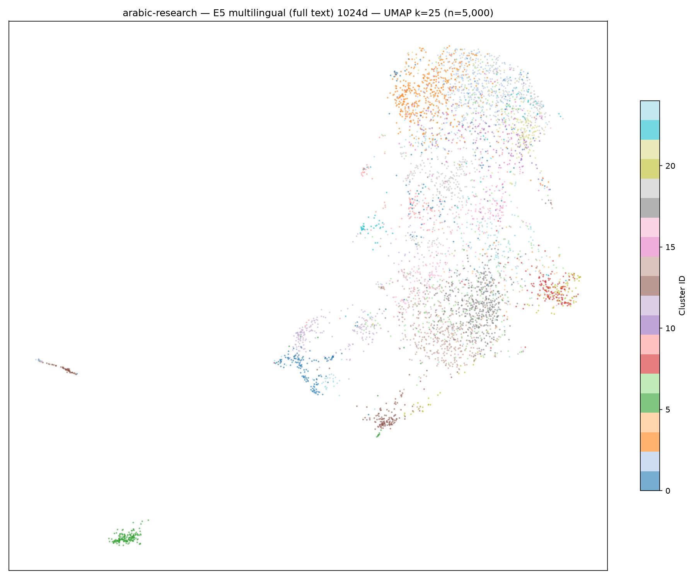
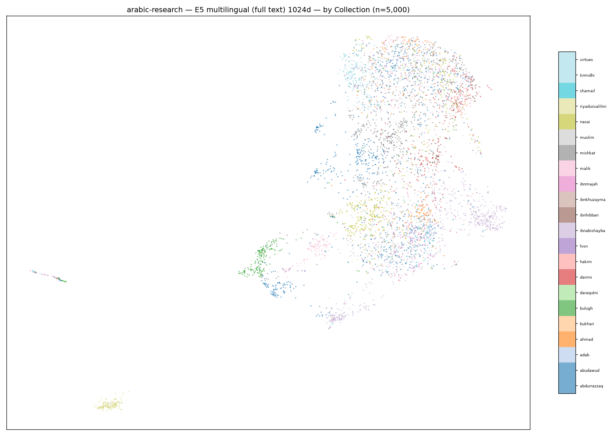
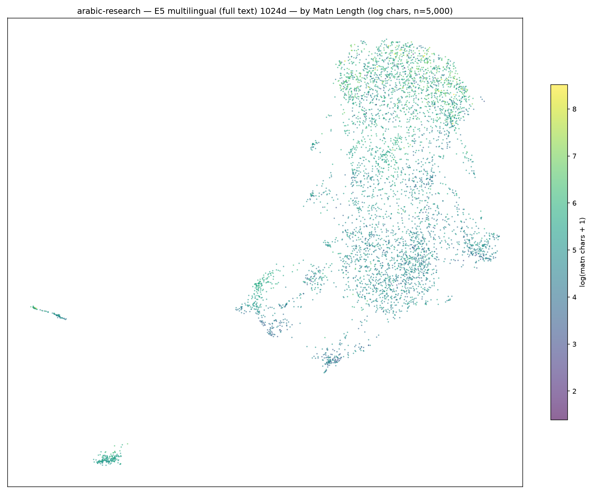
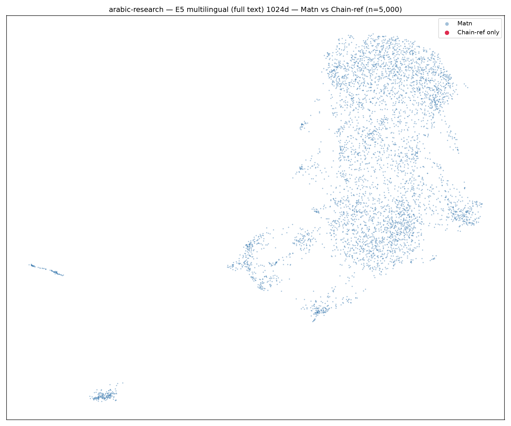
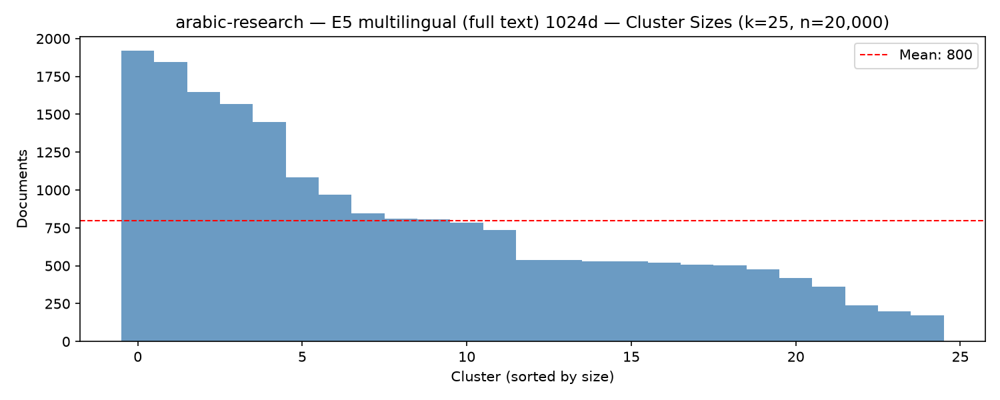
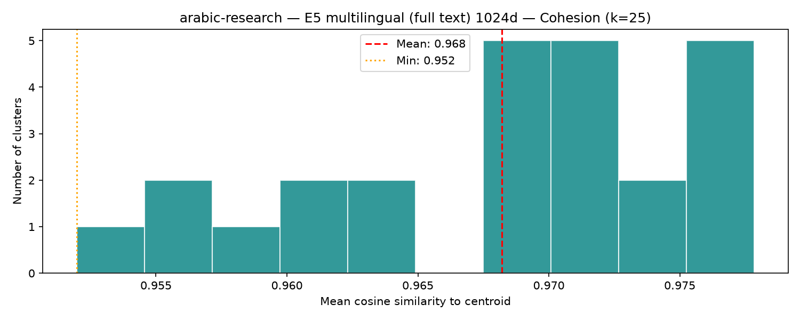

# arabic-research · vec_e5_full · k=25 Cluster Report

*2026-06-22 · 131,728 docs · 25 clusters · mean cohesion 0.968*

## Visualizations

| UMAP (by cluster) | UMAP (by collection) |
|---|---|
|  |  |

| UMAP (by matn length) | UMAP (matn vs chain-ref) |
|---|---|
|  |  |

| Cluster sizes | Cohesion distribution |
|---|---|
|  |  |

---

## 🏝️ Isolated Islands

These two clusters appear as geometrically isolated sub-clouds in the UMAP projection,
far from the main hadith mass. Both are pure Matn (no chain-refs) — likely highly
specialised textual registers.

> **🏝️ Left-strip island (1,838 docs)** — 1,838 docs · cohesion 0.956

### 🏝️ Island Cluster #5

**1,838 docs** · cohesion **0.956** · collections: riyadussalihin (1729) · ibnabishayba (61) · hisn (17) · virtues (10) · mishkat (9)

- وعن أبي عبد الرحمن عبد الله بن عمر بن الخطاب رضي الله عنهما عن النبي صلى الله عليه وسلم قال‏:‏ ‏"‏ إن الله عز وجل يقبل توبة العبد ما لم يغرغر‏"‏ ‏(‏‏(‏رواه الترمذي وقال‏:‏ حديث حسن‏)‏‏)‏‏.‏

<small>[riyadussalihin 18](https://sunnah.com/hadith/1700180) · Uncategorized</small>

- وعن أبي هريرة رضي الله عنه أن رسول الله صلى الله عليه وسلم قال‏:‏ ‏"‏المتسابان ما قالا فعلى البادي منهما حتى يعتدي المظلوم‏"‏ ‏(‏‏(‏رواه مسلم‏)‏‏)‏‏.‏

<small>[riyadussalihin 1561](https://sunnah.com/hadith/1715510) · Uncategorized</small>

- وعن أنس رضي الله عنه قال‏:‏ قال رسول الله صلى الله عليه وسلم‏:‏ ‏"‏ألظوا بيا ذا الجلال والإكرام‏"‏‏.‏ رواه الترمذي ورواه النسائي من رواية ربيعة بن عامر الصحابي قال الحاكم حديث صحيح الإسناد‏.‏

<small>[riyadussalihin 1491](https://sunnah.com/hadith/1714810) · Uncategorized</small>

- وعن عبد الله بن عمرو رضي الله عنهما أن رسول الله صلى الله عليه وسلم  قال‏:‏ ‏"‏قد أفلح من أسلم، ورزق كفافاً، وقنعه الله بما آتاه‏"‏ ‏(‏‏(‏رواه مسلم‏)‏‏)‏‏.‏

<small>[riyadussalihin 522](https://sunnah.com/hadith/1705180) · Uncategorized</small>

- وعن أبي هريرة رضي الله عنه أن رسول الله صلى الله عليه وسلم قال‏:‏ ‏"‏أقرب ما يكون العبد من ربه وهو ساجد، فأكثروا الدعاء‏"‏ ‏(‏‏(‏رواه مسلم‏)‏‏)‏‏.‏

<small>[riyadussalihin 1498](https://sunnah.com/hadith/1714880) · Uncategorized</small>

---

> **🏝️ Bottom-left island (1,273 docs)** — 1,273 docs · cohesion 0.962

### 🏝️ Island Cluster #12

**1,273 docs** · cohesion **0.962** · collections: abdurrazzaq (541) · bukhari (206) · ibnmajah (163) · bulugh (95) · tirmidhi (84)

‏"‏ الإِيمَانُ بِاللَّهِ وَرَسُولِهِ ‏"‏ ‏.‏

<small>[nasai 4985](https://sunnah.com/hadith/1150000) · Sahih</small>

لَقَدْ رَدَّ ذَلِكَ ـ يَعْنِي النَّبِيَّ صلى الله عليه وسلم ـ عَلَى عُثْمَانَ، وَلَوْ أَجَازَ لَهُ التَّبَتُّلَ لاَخْتَصَيْنَا‏.‏ [/postmatn]

<small>[bukhari 5074](https://sunnah.com/hadith/142770) · Sahih</small>

أَنْفَقَتِ الْمَرْأَةُ مِنْ كَسْبِ زَوْجِهَا عَنْ غَيْرِ أَمْرِهِ فَلَهُ نِصْفُ أَجْرِهِ ‏"

<small>[bukhari 5360](https://sunnah.com/hadith/145610) · Sahih</small>

رَسُولُ اللَّهِ صلى الله عليه وسلم ‏"‏ يَغْسِلُ ذَكَرَهُ ثُمَّ لْيَتَوَضَّأْ ‏"‏ ‏.‏

<small>[nasai 439](https://sunnah.com/hadith/1104400) · Sahih</small>

ـ صلى الله عليه وسلم ـ ‏"‏ أُمِرْتُ أَنْ أَسْجُدَ عَلَى سَبْعٍ وَلاَ أَكُفَّ شَعَرًا وَلاَ ثَوْبًا ‏"‏ ‏.‏
   
 قَالَ ابْنُ طَاوُسٍ فَكَانَ أَبِي يَقُولُ الْيَدَيْنِ وَالرُّكْبَتَيْنِ وَالْقَدَمَيْنِ وَكَانَ يَعُدُّ الْجَبْهَةَ وَالأَنْفَ وَاحِدًا ‏.‏

<small>[ibnmajah 884](https://sunnah.com/hadith/1309330) · Sahih</small>

---

---

## 📚 All Clusters (by size)

- [#17 — 9,373 docs, coh=0.977](#cluster-17)
- [#14 — 8,731 docs, coh=0.975](#cluster-14)
- [#21 — 7,840 docs, coh=0.976](#cluster-21)
- [#2 — 7,546 docs, coh=0.972](#cluster-2)
- [#6 — 7,444 docs, coh=0.966](#cluster-6)
- [#13 — 7,414 docs, coh=0.971](#cluster-13)
- [#16 — 7,262 docs, coh=0.973](#cluster-16)
- [#24 — 6,838 docs, coh=0.972](#cluster-24)
- [#20 — 6,619 docs, coh=0.972](#cluster-20)
- [#3 — 6,294 docs, coh=0.975](#cluster-3)
- [#9 — 6,074 docs, coh=0.956](#cluster-9)
- [#8 — 5,798 docs, coh=0.976](#cluster-8)
- [#19 — 5,714 docs, coh=0.973](#cluster-19)
- [#10 — 5,412 docs, coh=0.978](#cluster-10)
- [#15 — 4,163 docs, coh=0.969](#cluster-15)
- [#18 — 4,161 docs, coh=0.953](#cluster-18)
- [#22 — 4,155 docs, coh=0.963](#cluster-22)
- [#0 — 4,038 docs, coh=0.968](#cluster-0)
- [#11 — 3,577 docs, coh=0.964](#cluster-11)
- [#4 — 3,210 docs, coh=0.969](#cluster-4)
- [#1 — 2,901 docs, coh=0.964](#cluster-1)
- [#7 — 2,227 docs, coh=0.970](#cluster-7)
- [🏝️ Island: #5 — 1,838 docs, coh=0.956](#cluster-5)
- [#23 — 1,826 docs, coh=0.957](#cluster-23)
- [🏝️ Island: #12 — 1,273 docs, coh=0.962](#cluster-12)

---

### Cluster #17

**9,373 docs** · cohesion **0.977** · collections: bukhari (1566) · muslim (1553) · ibnmajah (1358) · abudawud (1300) · ibnabishayba (1085)

كَانَتْ لِلنَّبِيِّ صلى الله عليه وسلم سُكَّةٌ يَتَطَيَّبُ مِنْهَا ‏.‏

<small>[abudawud 4162](https://sunnah.com/hadith/941650) · Sahih</small>

نَهَانِي رَسُولُ اللَّهِ صَلَّى اللَّهُ عَلَيْهِ وَسَلَّمَ عَنْ خَاتَمِ الذَّهَبِ وَعَنْ الْمِيثَرَةِ وَعَنْ الْقَسِّيِّ وَعَنْ الْجِعَةِ‏.‏

<small>[ahmad 1102](https://sunnah.com/hadith/5310470) · Hasan</small>

نَهَانِي رَسُولُ اللَّهِ صَلَّى اللَّهُ عَلَيْهِ وَسَلَّمَ عَنْ خَاتَمِ الذَّهَبِ وَعَنْ لُبْسِ الْحَمْرَاءِ وَعَنْ الْقِرَاءَةِ فِي الرُّكُوعِ وَالسُّجُودِ‏.‏

<small>[ahmad 939](https://sunnah.com/hadith/5308950) · Sahih</small>

ـ صلى الله عليه وسلم ـ ‏"‏ إِذَا مَسَّ أَحَدُكُمْ ذَكَرَهُ فَلْيَتَوَضَّأْ ‏"‏ ‏.‏

<small>[ibnmajah 479](https://sunnah.com/hadith/1305160) · Hasan</small>

أَمَرَنَا رَسُولُ اللَّهِ صلى الله عليه وسلم بِإِقْصَارِ الْخُطَبِ ‏.‏

<small>[abudawud 1106](https://sunnah.com/hadith/911090) · Sahih</small>

---

### Cluster #14

**8,731 docs** · cohesion **0.975** · collections: muslim (1843) · ibnabishayba (1527) · bukhari (1294) · abudawud (1200) · ibnmajah (1188)

نَهَى رَسُولُ اللَّهِ صلى الله عليه وسلم عَنْ أَكْلِ الْجَلاَّلَةِ وَأَلْبَانِهَا ‏.‏

<small>[abudawud 3785](https://sunnah.com/hadith/937880) · Sahih</small>

نَهَى رَسُولُ اللَّهِ ـ صلى الله عليه وسلم ـ عَنْ بَيْعَتَيْنِ عَنِ الْمُلاَمَسَةِ وَالْمُنَابَذَةِ ‏.‏

<small>[ibnmajah 2169](https://sunnah.com/hadith/1322540) · Sahih</small>

بَعَثَ رَسُولُ اللَّهِ صلى الله عليه وسلم سَرِيَّةً إِلَى نَجْدٍ فَخَرَجْتُ فِيهَا فَأَصَبْنَا إِبِلاً وَغَنَمًا فَبَلَغَتْ سُهْمَانُنَا اثْنَىْ عَشَرَ بَعِيرًا وَنَفَّلَنَا رَسُولُ اللَّهِ صلى الله عليه وسلم بَعِيرًا بَعِيرًا ‏.‏

<small>[muslim 1749 c](https://sunnah.com/hadith/346940) · Sahih</small>

قَبَّلْنَا يَدَ النَّبِيِّ ـ صلى الله عليه وسلم ـ ‏.‏

<small>[ibnmajah 3704](https://sunnah.com/hadith/1338350) · Da'if</small>

‏"‏ أَمَّا بَعْدُ ‏"‏ ‏.‏

<small>[abudawud 4973](https://sunnah.com/hadith/949760) · Sahih</small>

---

### Cluster #21

**7,840 docs** · cohesion **0.976** · collections: ibnhibban (2666) · hakim (2262) · nasai (701) · ibnkhuzayma (583) · abdurrazzaq (419)

" خِيَارُكُمْ أَطْوَلُكُمْ أَعْمَارًا ، وَأَحْسَنُكُمْ أَعْمَالا "

<small>[ibnhibban ](https://sunnah.com/hadith/6630570) · Uncategorized</small>

" مَعَاذَ اللَّهِ ، أَنْ أَرُدَّ شَيْئًا نَفَّلَنِيهِ رَسُولُ اللَّهِ صَلَّى اللَّهُ عَلَيْهِ وَسَلَّمَ " ، فَلَمْ يَرُدَّ إِلَيْهِمْ شَيْئًا

<small>[hakim ](https://sunnah.com/hadith/6817250) · Uncategorized</small>

صَلَّى الظُّهْرَ وَالْعَصْرَ ، وَالْمَغْرِبَ وَالْعِشَاءَ ، وَرَقَدَ رَقْدَةً بِمِنًى ، ثُمَّ رَكِبَ إِلَى الْبَيْتِ ، فَطَافَ بِهِ "

<small>[ibnhibban ](https://sunnah.com/hadith/6639720) · Uncategorized</small>

" كُلُّ مَا أَسْكَرَ عَنِ الصَّلاةِ فَهُوَ حَرَامٌ "

<small>[ibnhibban ](https://sunnah.com/hadith/6654870) · Uncategorized</small>

" اللَّهُ وَرَسُولُهُ مَوْلَى مَنْ لا مَوْلَى لَهُ ، وَالْخَالُ وَارِثُ مَنْ لا وَارِثَ لَهُ "

<small>[hakim ](https://sunnah.com/hadith/6880770) · Uncategorized</small>

---

### Cluster #2

**7,546 docs** · cohesion **0.972** · collections: bukhari (1524) · muslim (1165) · ibnabishayba (787) · abudawud (773) · tirmidhi (583)

فَرِيضَةَ اللَّهِ عَلَى عِبَادِهِ أَدْرَكَتْ أَبِي شَيْخًا كَبِيرًا لاَ يَسْتَطِيعُ أَنْ يَسْتَوِيَ عَلَى الرَّاحِلَةِ، فَهَلْ يَقْضِي أَنْ أَحُجَّ عَنْهُ قَالَ ‏"‏ نَعَمْ ‏"

<small>[bukhari 4399](https://sunnah.com/hadith/140290) · Sahih</small>

"‏ هَلْ وَجَدْتُمْ مَا وَعَدَكُمْ رَبُّكُمْ حَقًّا ‏"‏‏.‏ قَالَ [narrator id="7756" role="chain" tooltip="موسى بن عقبة القرشي"]مُوسَى[/narrator] قَالَ [narrator id="7863" role="chain" tooltip="نافع مولى ابن عمر"]نَافِعٌ[/narrator] قَالَ [narrator id="4967" role="sahabi" tooltip="عبد الله بن عمر العدوي"]عَبْدُ اللَّهِ[/narrator] قَالَ نَاسٌ مِنْ أَصْحَابِهِ يَا رَسُولَ اللَّهِ تُنَادِي نَاسًا أَمْوَاتًا قَالَ رَسُولُ اللَّهِ صلى الله عليه وسلم ‏"‏ مَا أَنْتُمْ بِأَسْمَعَ لِمَا قُلْتُ مِنْهُمْ ‏"

<small>[bukhari 4026](https://sunnah.com/hadith/136630) · Sahih</small>

صلى الله عليه وسلم لِغُرَمَائِهِ ‏"‏ خُذُوا مَا وَجَدْتُمْ وَلَيْسَ لَكُمْ إِلاَّ ذَلِكَ ‏"‏ ‏.‏ قَالَ وَفِي الْبَابِ عَنْ عَائِشَةَ وَجُوَيْرِيَةَ وَأَنَسٍ ‏.‏ قَالَ أَبُو عِيسَى حَدِيثُ أَبِي سَعِيدٍ حَدِيثٌ حَسَنٌ صَحِيحٌ ‏.‏

<small>[tirmidhi 655](https://sunnah.com/hadith/706560) · Sahih</small>

يَا رَسُولَ اللَّهِ لَقَدْ جِئْتُكَ مِنْ عِنْدِ قَوْمٍ مَا يَتَزَوَّدُ لَهُمْ رَاعٍ وَلاَ يَخْطِرُ لَهُمْ فَحْلٌ ‏.‏ فَصَعِدَ الْمِنْبَرَ فَحَمِدَ اللَّهَ ثُمَّ قَالَ ‏"‏ اللَّهُمَّ اسْقِنَا غَيْثًا مُغِيثًا مَرِيئًا طَبَقًا مَرِيعًا غَدَقًا عَاجِلاً غَيْرَ رَائِثٍ ‏"‏ ‏.‏ ثُمَّ نَزَلَ فَمَا يَأْتِيهِ أَحَدٌ مِنْ وَجْهٍ مِنَ الْوُجُوهِ إِلاَّ قَالُوا قَدْ أُحْيِينَا ‏.‏

<small>[ibnmajah 1270](https://sunnah.com/hadith/1313280) · Uncategorized</small>

مَنْ حَلَفَ يَمِينَ صَبْرٍ لِيَقْتَطِعَ بِهَا مَالَ امْرِئٍ مُسْلِمٍ، لَقِيَ اللَّهَ وَهْوَ عَلَيْهِ غَضْبَانُ ‏"‏‏.‏ فَأَنْزَلَ اللَّهُ تَصْدِيقَ ذَلِكَ ‏[quran sura="3" aya_start="77" aya_end="77"]{‏إِنَّ الَّذِينَ يَشْتَرُونَ بِعَهْدِ اللَّهِ وَأَيْمَانِهِمْ ثَمَنًا قَلِيلاً أُولَئِكَ لاَ خَلاَقَ لَهُمْ فِي الآخِرَةِ‏}[/quran]‏ إِلَى آخِرِ الآيَةِ‏.‏       قَالَ فَدَخَلَ [narrator id="583" role="sahabi" tooltip="أشعث بن قيس الكندي"]الأَشْعَثُ بْنُ قَيْسٍ[/narrator] وَقَالَ مَا يُحَدِّثُكُمْ أَبُو عَبْدِ الرَّحْمَنِ قُلْنَا كَذَا وَكَذَا‏.‏ قَالَ فِيَّ أُنْزِلَتْ كَانَتْ لِي بِئْرٌ فِي أَرْضِ ابْنِ عَمٍّ لِي قَالَ النَّبِيُّ صلى الله عليه وسلم ‏"‏ بَيِّنَتُكَ أَوْ يَمِينُهُ ‏"‏ فَقُلْتُ إِذًا يَحْلِفَ يَا رَسُولَ اللَّهِ‏.‏ فَقَالَ النَّبِيُّ صلى الله عليه وسلم ‏"‏ مَنْ حَلَفَ عَلَى يَمِينِ صَبْرٍ يَقْتَطِعُ بِهَا مَالَ امْرِئٍ مُسْلِمٍ وَهْوَ فِيهَا فَاجِرٌ، لَقِيَ اللَّهَ وَهْوَ عَلَيْهِ غَضْبَانٌ ‏"

<small>[bukhari 4549, 4550](https://sunnah.com/hadith/178781) · Sahih</small>

---

### Cluster #6

**7,444 docs** · cohesion **0.966** · collections: ibnabishayba (4495) · bukhari (571) · muslim (368) · abudawud (311) · darimi (304)

إِذَا وَجَدَ نَرْدًا فِي بَيْتٍ كَسَّرَهَا ، وَضَرَبَ مَنْ لَعِبَ بِهَا "

<small>[ibnabishayba ](https://sunnah.com/hadith/7527825) · Uncategorized</small>

" لَوْ لَمْ أَعِشْ أَوَلَمْ أَكُنْ فِي الدُّنْيَا إلَّا عَشْرًا لَأَحْبَبْتُ أَنْ يَكُونَ عندِي فِيهِنَّ امْرَأَةٌ "

<small>[ibnabishayba ](https://sunnah.com/hadith/7459545) · Uncategorized</small>

" آيِبُونَ تَائِبُونَ عَابِدُونَ لِرَبِّنَا حَامِدُونَ "

<small>[ibnabishayba ](https://sunnah.com/hadith/7564640) · Uncategorized</small>

فِتَنٌ قَدْ أَظَلَّتْ كَجِبَاهِ الْبَقَرِ ، يَهْلِكُ فِيهَا أَكْثَرُ النَّاسِ إِلَّا مَنْ كَانَ يَعْرِفُهَا قَبْلَ ذَلِكَ "

<small>[ibnabishayba ](https://sunnah.com/hadith/7582470) · Uncategorized</small>

ثَمَنَ الْمِجَنِّ يَوْمَئِذٍ ، عَشَرَةَ دَرَاهِمَ "

<small>[daraqutni ](https://sunnah.com/hadith/7829980) · Uncategorized</small>

---

### Cluster #13

**7,414 docs** · cohesion **0.971** · collections: ibnabishayba (6479) · abdurrazzaq (307) · muslim (231) · darimi (112) · abudawud (78)

" لَا يُشْفَعُ فِي حَدٍّ "

<small>[ibnabishayba ](https://sunnah.com/hadith/7537540) · Uncategorized</small>

حَدَّثَنَا أَبُو بَكْرٍ ، قَالَ : حَدَّثَنَا وكِيعٌ ، عَنْ سُفْيَانَ ، عَنْ عَبَّاسٍ ، عَنْ سَعِيدِ بْنِ جُبَيْرٍ ، قَالَ : " يُمِرُّ عَلَى رَأْسِهِ الْمُوسَى "

<small>[ibnabishayba ](https://sunnah.com/hadith/7482215) · Uncategorized</small>

" فِيهِ الدِّيَةُ "

<small>[ibnabishayba ](https://sunnah.com/hadith/7531820) · Uncategorized</small>

الْحَشَفَةِ الدِّيَةُ "

<small>[ibnabishayba ](https://sunnah.com/hadith/7532660) · Uncategorized</small>

هُوَ رِبًا

<small>[ibnabishayba ](https://sunnah.com/hadith/7504920) · Uncategorized</small>

---

### Cluster #16

**7,262 docs** · cohesion **0.973** · collections: nasai (1908) · ibnhibban (1632) · darimi (999) · hakim (669) · daraqutni (660)

" صَلَّى لَنَا رَسُولُ اللَّهِ صَلَّى اللَّهُ عَلَيْهِ وَسَلَّمَ "

<small>[ibnhibban ](https://sunnah.com/hadith/6622980) · Uncategorized</small>

" الْعُمْرَى لِمَنْ أَُعْمِرَهَا ، وَالرُّقْبَى لَمْ أَُرْقِيَهَا "

<small>[ibnhibban ](https://sunnah.com/hadith/6652380) · Uncategorized</small>

نَعَى لِلنَّاسِ النَّجَاشِيَّ ، فِي الْيَوْمِ الَّذِي مَاتَ فِيهِ ، وَخَرَجَ إِلَى الْمُصَلَّى ، فَصَفَّ بِهِمْ وَكَبَّرَ أَرْبَعَ تَكْبِيرَاتٍ

<small>[ibnhibban ](https://sunnah.com/hadith/6631760) · Uncategorized</small>

نَهَى عَنْ بَيْعِ حَبَلِ الْحَبَلَةِ "

<small>[ibnhibban ](https://sunnah.com/hadith/6650540) · Uncategorized</small>

عَمْرٌو إِنَّ رَسُولَ اللَّهِ صلى الله عليه وسلم - كَانَ طَلَّقَ حَفْصَةَ ثُمَّ رَاجَعَهَا ‏.‏ وَاللَّهُ أَعْلَمُ ‏.‏

<small>[nasai 3560](https://sunnah.com/hadith/1135730) · Sahih</small>

---

### Cluster #24

**6,838 docs** · cohesion **0.972** · collections: ibnabishayba (3583) · bukhari (471) · hakim (374) · muslim (371) · darimi (310)

" فَرَسٌ يُدْعَى الْمُرْتَجِزَ "

<small>[hakim ](https://sunnah.com/hadith/6841380) · Uncategorized</small>

‏"‏ مَا هَذَا ‏"‏ ‏.‏ فَقُلْنَا قَدْ وَهَى فَنَحْنُ نُصْلِحُهُ ‏.‏ قَالَ ‏"‏ مَا أُرَى الأَمْرَ إِلاَّ أَعْجَلَ مِنْ ذَلِكَ ‏"‏ ‏.‏ قَالَ أَبُو عِيسَى هَذَا حَدِيثٌ حَسَنٌ صَحِيحٌ ‏.‏ وَأَبُو السَّفَرِ اسْمُهُ سَعِيدُ بْنُ يُحْمِدَ وَيُقَالُ ابْنُ أَحْمَدَ الثَّوْرِيُّ ‏.‏

<small>[tirmidhi 2335](https://sunnah.com/hadith/725010) · Sahih</small>

‏"‏ مَنْ سَكَنَ الْبَادِيَةَ جَفَا وَمَنِ اتَّبَعَ الصَّيْدَ غَفَلَ وَمَنْ أَتَى أَبْوَابَ السَّلاَطِينِ افْتُتِنَ ‏"‏ ‏.‏ قَالَ وَفِي الْبَابِ عَنْ أَبِي هُرَيْرَةَ ‏.‏ قَالَ أَبُو عِيسَى هَذَا حَدِيثٌ حَسَنٌ غَرِيبٌ مِنْ حَدِيثِ ابْنِ عَبَّاسٍ لاَ نَعْرِفُهُ إِلاَّ مِنْ حَدِيثِ الثَّوْرِيِّ ‏.‏

<small>[tirmidhi 2256](https://sunnah.com/hadith/724170) · Hasan</small>

ثَمَنُ الْمِجَنِّ عَلَى عَهْدِ رَسُولِ اللَّهِ صَلَّى اللَّهُ عَلَيْهِ وَسَلَّمَ ، عَشْرَةَ دَرَاهِمَ "

<small>[daraqutni ](https://sunnah.com/hadith/7829920) · Uncategorized</small>

" يَبُولُ فِي قَدَحٍ مِنْ عِيدَانٍ ، ثُمَّ يُوضَعُ تَحْتَ سَرِيرِهِ "

<small>[ibnhibban ](https://sunnah.com/hadith/6614540) · Uncategorized</small>

---

### Cluster #20

**6,619 docs** · cohesion **0.972** · collections: ibnabishayba (6498) · daraqutni (31) · ibnmajah (18) · muslim (15) · darimi (13)

هُوَ أَحَقُّ بِهَا مَا لَمْ يَرْضَ مِنْهَا "

<small>[ibnabishayba ](https://sunnah.com/hadith/7505520) · Uncategorized</small>

أَكَلَ مَعَ أَصْحَابِهِ تَمْرًا " ، فَقَالَ : " إِنِّي قَدْ قَارَنْتُ ، فَقَارِنُوا "

<small>[ibnabishayba ](https://sunnah.com/hadith/7519480) · Uncategorized</small>

" يَجْعَلُ فِيهَا بِقَدْرِ مَا نَقَصَ مِنْهَا "

<small>[ibnabishayba ](https://sunnah.com/hadith/7532375) · Uncategorized</small>

نَهَاهُمْ ، عَنْ سَلَفٍ وَبَيْعٍ , وَعَنْ شَرْطَيْنِ فِي بَيْعٍ , وَعَنْ رِبْحِ مَا لَمْ يَضْمَنُوا "

<small>[ibnabishayba ](https://sunnah.com/hadith/7507220) · Uncategorized</small>

" إذَا اشْتَرَاهَا وَاشْتَرَطَ عِتْقَهَا : كَانَا لَا يَرَيَانِهَا سَلِيمَةً "

<small>[ibnabishayba ](https://sunnah.com/hadith/7500885) · Uncategorized</small>

---

### Cluster #3

**6,294 docs** · cohesion **0.975** · collections: tirmidhi (1702) · muslim (1066) · abudawud (807) · bukhari (625) · ahmad (478)

اسْتَكْسَيْتُ رَسُولَ اللَّهِ صلى الله عليه وسلم فَكَسَانِي خَيْشَتَيْنِ فَلَقَدْ رَأَيْتُنِي وَأَنَا أَكْسَى أَصْحَابِي ‏.‏

<small>[abudawud 4032](https://sunnah.com/hadith/940350) · Sahih</small>

هَدَرٌ لاَ دِيَةَ فِيهِ ‏.‏ قَالَ أَبُو عِيسَى وَمَعْنَى قَوْلِهِ ‏"‏ الْعَجْمَاءُ جُرْحُهَا جُبَارٌ ‏"‏ ‏.‏ فَسَّرَ ذَلِكَ بَعْضُ أَهْلِ الْعِلْمِ قَالُوا الْعَجْمَاءُ الدَّابَّةُ الْمُنْفَلِتَةُ مِنْ صَاحِبِهَا فَمَا أَصَابَتْ فِي انْفِلاَتِهَا فَلاَ غُرْمَ عَلَى صَاحِبِهَا ‏.‏ ‏"‏ وَالْمَعْدِنُ جُبَارٌ ‏"‏ ‏.‏ يَقُولُ إِذَا احْتَفَرَ الرَّجُلُ مَعْدِنًا فَوَقَعَ فِيهَا إِنْسَانٌ فَلاَ غُرْمَ عَلَيْهِ وَكَذَلِكَ الْبِئْرُ إِذَا احْتَفَرَهَا الرَّجُلُ لِلسَّبِيلِ فَوَقَعَ فِيهَا إِنْسَانٌ فَلاَ غُرْمَ عَلَى صَاحِبِهَا ‏.‏ ‏"‏ وَفِي الرِّكَازِ الْخُمُسُ ‏"‏ ‏.‏ وَالرِّكَازُ مَا وُجِدَ فِي دَفْنِ أَهْلِ الْجَاهِلِيَّةِ ‏.‏ فَمَنْ وَجَدَ رِكَازًا أَدَّى مِنْهُ الْخُمُسَ إِلَى السُّلْطَانِ وَمَا بَقِيَ فَهُوَ لَهُ ‏.‏

<small>[tirmidhi 1377](https://sunnah.com/hadith/714321) · Sahih</small>

‏"‏ قَالَ اللَّهُ عَزَّ وَجَلَّ الْمُتَحَابُّونَ فِي جَلاَلِي لَهُمْ مَنَابِرُ مِنْ نُورٍ يَغْبِطُهُمُ النَّبِيُّونَ وَالشُّهَدَاءُ ‏"‏ ‏.‏ وَفِي الْبَابِ عَنْ أَبِي الدَّرْدَاءِ وَابْنِ مَسْعُودٍ وَعُبَادَةَ بْنِ الصَّامِتِ وَأَبِي هُرَيْرَةَ وَأَبِي مَالِكٍ الأَشْعَرِيِّ ‏.‏ قَالَ أَبُو عِيسَى هَذَا حَدِيثٌ حَسَنٌ صَحِيحٌ ‏.‏ وَأَبُو مُسْلِمٍ الْخَوْلاَنِيُّ اسْمُهُ عَبْدُ اللَّهِ بْنُ ثُوَبَ ‏.‏

<small>[tirmidhi 2390](https://sunnah.com/hadith/725620) · Sahih</small>

صلى الله عليه وسلم ‏"‏ إِنَّ اللَّهَ تَعَالَى خَلَقَ آدَمَ مِنْ قَبْضَةٍ قَبَضَهَا مِنْ جَمِيعِ الأَرْضِ فَجَاءَ بَنُو آدَمَ عَلَى قَدْرِ الأَرْضِ فَجَاءَ مِنْهُمُ الأَحْمَرُ وَالأَبْيَضُ وَالأَسْوَدُ وَبَيْنَ ذَلِكَ وَالسَّهْلُ وَالْحَزْنُ وَالْخَبِيثُ وَالطَّيِّبُ ‏"‏ ‏.‏ قَالَ أَبُو عِيسَى هَذَا حَدِيثٌ حَسَنٌ صَحِيحٌ ‏.‏

<small>[tirmidhi 2955](https://sunnah.com/hadith/739390) · Sahih</small>

‏"‏ مَا مِنْ نَبِيٍّ بَعَثَهُ اللَّهُ فِي أُمَّةٍ قَبْلِي إِلاَّ كَانَ لَهُ مِنْ أُمَّتِهِ حَوَارِيُّونَ وَأَصْحَابٌ يَأْخُذُونَ بِسُنَّتِهِ وَيَقْتَدُونَ بِأَمْرِهِ ثُمَّ إِنَّهَا تَخْلُفُ مِنْ بَعْدِهِمْ خُلُوفٌ يَقُولُونَ مَا لاَ يَفْعَلُونَ وَيَفْعَلُونَ مَا لاَ يُؤْمَرُونَ فَمَنْ جَاهَدَهُمْ بِيَدِهِ فَهُوَ مُؤْمِنٌ وَمَنْ جَاهَدَهُمْ بِلِسَانِهِ فَهُوَ مُؤْمِنٌ وَمَنْ جَاهَدَهُمْ بِقَلْبِهِ فَهُوَ مُؤْمِنٌ وَلَيْسَ وَرَاءَ ذَلِكَ مِنَ الإِيمَانِ حَبَّةُ خَرْدَلٍ ‏"‏ ‏.‏ قَالَ أَبُو رَافِعٍ فَحَدَّثْتُهُ عَبْدَ اللَّهِ بْنَ عُمَرَ فَأَنْكَرَهُ عَلَىَّ فَقَدِمَ ابْنُ مَسْعُودٍ فَنَزَلَ بِقَنَاةَ فَاسْتَتْبَعَنِي إِلَيْهِ عَبْدُ اللَّهِ بْنُ عُمَرَ يَعُودُهُ فَانْطَلَقْتُ مَعَهُ فَلَمَّا جَلَسْنَا سَأَلْتُ ابْنَ مَسْعُودٍ عَنْ هَذَا الْحَدِيثِ فَحَدَّثَنِيهِ كَمَا حَدَّثْتُهُ ابْنَ عُمَرَ ‏.‏ قَالَ صَالِحٌ وَقَدْ تُحُدِّثَ بِنَحْوِ ذَلِكَ عَنْ أَبِي رَافِعٍ ‏.‏

<small>[muslim 50 a](https://sunnah.com/hadith/301880) · Sahih</small>

---

### Cluster #9

**6,074 docs** · cohesion **0.956** · collections: abdurrazzaq (5734) · ibnabishayba (113) · bulugh (40) · hakim (40) · mishkat (36)

حِمَارُ وَحْشٍ أَصَابَهُ رَجُلٌ حَلالٌ وَهُمْ مُحْرِمُونَ ، قَالَ : فَأَكَلْنَا مِنْهُ ، فَقَالَ عُمَرُ : لَوْ تَرَكْتَهُ لَرَأَيْتُ أَنَّكَ لا تَفْقَهُ شَيْئًا "

<small>[abdurrazzaq ](https://sunnah.com/hadith/7081200) · Uncategorized</small>

إِذَا خَيَّرَ الرَّجُلُ امْرَأَتَهُ ، أَوْ مَلَّكَهَا ، وافْتَرَقَا مِنْ ذَلِكَ الْمَجْلِسِ ، ولَمْ يَحْلِفْ شَيْئًا ، فَأَمْرُهَا إِلَى زَوْجِهَا "

<small>[abdurrazzaq ](https://sunnah.com/hadith/7116040) · Uncategorized</small>

إِذَا قَامَ أَحَدُكُمْ مِنَ اللَّيْلِ فَاسْتَعْجَمَ الْقُرْآنُ عَلَى لِسَانِهِ , فَلَمْ يَدْرِ مَا يَقُولُ : فَلْيَنْصَرِفْ فَلْيَضْطَجِعْ "

<small>[abdurrazzaq ](https://sunnah.com/hadith/7040870) · Uncategorized</small>

مَرَّ [narrator id="5079" role="sahabi" tooltip="عبد الله بن مسعود"]ابْنُ مَسْعُودٍ[/narrator] بِرَجُلٍ صَافٍّ بَيْنَ قَدَمَيْهِ , فَقَالَ : " أَمَّا هَذَا فَقَدْ أَخْطَأَ السُّنَّةَ , لَوْ رَاوَحَ بِهِمَا كَانَ أَحَبَّ إِلَيَّ "

<small>[abdurrazzaq ](https://sunnah.com/hadith/7032010) · Uncategorized</small>

يَغْتَسِلُ يَوْمَ الْفِطْرِ وَيَوْمَ الأَضْحَى قَبْلَ أَنْ يَغْدُوَ "

<small>[abdurrazzaq ](https://sunnah.com/hadith/7055930) · Uncategorized</small>

---

### Cluster #8

**5,798 docs** · cohesion **0.976** · collections: ibnabishayba (5297) · hakim (125) · daraqutni (87) · muslim (81) · ibnmajah (76)

النَّبِيُّ صَلَّى اللَّهُ عَلَيْهِ وَسَلَّمَ إذَا خَطَبَ اسْتَقْبَلَهُ أَصْحَابُهُ بِوُجُوهِهِمْ "

<small>[ibnabishayba ](https://sunnah.com/hadith/7425445) · Uncategorized</small>

" نَهَى رَسُولُ اللَّهِ صَلَّى اللَّهُ عَلَيْهِ وَسَلَّمَ عَنِ الْمُعَصْفَرِ "

<small>[ibnabishayba ](https://sunnah.com/hadith/7520715) · Uncategorized</small>

" نَهَى رَسُولُ اللَّهِ صَلَّى اللَّهُ عَلَيْهِ وَسَلَّمَ أَنْ يُوَطِّنَ الرَّجُلُ الْمَكَانَ يُصَلِّي فِيهِ كَمَا يُوَطِّنُ الْبَعِيرُ "

<small>[ibnabishayba ](https://sunnah.com/hadith/7424215) · Uncategorized</small>

زَجَرَ رَسُولُ اللَّهِ صَلَّى اللَّهُ عَلَيْهِ وَسَلَّمَ رَجُلا شَرِبَ قَائِمًا "

<small>[ibnabishayba ](https://sunnah.com/hadith/7517600) · Uncategorized</small>

" رَخَّصَ رَسُولُ اللَّهِ صَلَّى اللَّهُ عَلَيْهِ وَسَلَّمَ فِي الرُّقْيَةِ مِنَ الْعَيْنِ وَالْحُمَةِ "

<small>[ibnabishayba ](https://sunnah.com/hadith/7514640) · Uncategorized</small>

---

### Cluster #19

**5,714 docs** · cohesion **0.973** · collections: ibnhibban (1098) · ibnabishayba (1029) · hakim (968) · mishkat (549) · abdurrazzaq (460)

" هَلْ لَكَ أَنْ أُرِيَكَ آيَةً " ، وَعِنْدَهُ نَخْلٌ وَشَجَرٌ ، فَدَعَا رَسُولُ اللَّهِ صَلَّى اللَّهُ عَلَيْهِ وَسَلَّمَ عِذْقًا مِنْهَا ، فَأَقْبَلَ إِِلَيْهِ وَهُوَ يَسْجُدُ ، وَيَرْفَعُ رَأْسَهُ وَيَسْجُدُ ، وَيَرْفَعُ رَأْسَهُ حَتَّى انْتَهَى إِِلَيْهِ صَلَّى اللَّهُ عَلَيْهِ وَسَلَّمَ ، فَقَامَ بَيْنَ يَدَيْهِ ، ثُمَّ قَالَ لَهُ صَلَّى اللَّهُ عَلَيْهِ وَسَلَّمَ : ارْجِعْ إِِلَى مَكَانِكَ ، فَقَالَ الْعَامِرِيُّ : وَاللَّهِ لا أُكَذِّبُكَ بِشَيْءٍ تَقُولُهُ أَبَدًا ، ثُمَّ قَالَ : يَا آلَ عَامِرِ بْنِ صَعْصَعَةَ ، وَاللَّهِ لا أُكَذِّبُهُ بِشَيْءٍ "

<small>[ibnhibban ](https://sunnah.com/hadith/6666620) · Uncategorized</small>

اللَّهَ فَرَضَ عَلَيْكُمُ الْحَجَّ " ، فَقَامَ رَجُلٌ ، فَقَالَ : أَوَفِي كُلِّ عَامٍ ؟ حَتَّى قَالَ ذَلِكَ ثَلاثَ مَرَّاتٍ ، وَرَسُولُ اللَّهِ يَعْرِضُ عَنْهُ ، ثُمَّ قَالَ : " لَوْ قُلْتُ : نَعَمْ ، لَوَجَبَتْ ، وَلَوْ وَجَبَتْ لَمَا قُمْتُمْ بِهِ " ، ثُمَّ قَالَ : " ذَرُونِي مَا تَرَكْتُكُمْ ، فَإِنَّمَا هَلَكَ مَنْ كَانَ قَبْلَكُمْ بِسُؤَالِهِمْ ، وَاخْتِلافِهِمْ عَلَى أَنْبِيَائِهِمْ ، فَمَا أَمَرْتُكُمْ مِنْ شَيْءٍ ، فَأْتُوا مِنْهُ مَا اسْتَطَعْتُمْ ، وَمَا نَهَيْتُكُمْ مِنْ شَيْءٍ فَاجْتَنِبُوهُ "

<small>[ibnhibban ](https://sunnah.com/hadith/6637880) · Uncategorized</small>

عِتْقُ النَّسَمَةِ أَنْ تَفَرَّدَ بِعِتْقِهَا , وَفَكُّ الرَّقَبَةِ أَنْ تُعِينَ فِي ثَمَنِهَا , وَالْمَنِحَةُ الْوَكُوفُ , وَالْفَيْءُ عَلَى ذِي الرَّحِمِ الظَّالِمِ , فَإِنْ لَمْ تُطِقْ فَكُفَّ لِسَانَكَ إِلا مِنْ خَيْرٍ "

<small>[daraqutni ](https://sunnah.com/hadith/7818130) · Uncategorized</small>

" يَا بِنْتَ حُيَيٍّ مَا هَذَا ؟ " , قُلْتُ : أُسَبِّحُ بِهِنَّ , قَالَ : " قَدْ سَبَّحْتُ مُنْذُ قُمْتُ عَلَى رَأْسِكِ أَكْثَرَ مِنْ هَذَا " , قُلْتُ : عَلِّمْنِي يَا رَسُولَ اللَّهِ , قَالَ : " قُولِي سُبْحَانَ اللَّهِ عَدَدَ مَا خَلَقَ مِنْ شَيْءٍ "

<small>[hakim ](https://sunnah.com/hadith/6819440) · Uncategorized</small>

اللَّهَ قَدِ افْتَرَضَ عَلَيْكُمُ الْحَجَّ " ، فَقَالَ رَجُلٌ : أَكُلَّ عَامٍ يَا رَسُولَ اللَّهِ ؟ فَسَكَتَ عَنْهُ حَتَّى أَعَادَهَا ثَلاثًا ، فَقَالَ : " لَوْ قُلْتُ : نَعَمْ لَوَجَبَتْ ، وَلَوْ وَجَبَتْ مَا قُمْتُمْ بِهَا " ، وَقَالَ : " ذَرُونِي مَا تَرَكْتُكُمْ ، فَإِنَّمَا هَلَكَ الَّذِينَ مِنْ قِبَلِكُمْ بِكَثْرَةِ سُؤَالِهِمْ وَاخْتِلافِهِمْ عَلَى أَنْبِيَائِهِمْ ، فَمَا أَمَرْتُكُمْ بِشَيْءٍ ، فَأْتُوهُ مَا اسْتَطَعْتُمْ ، وَإِذَا نَهَيْتُكُمْ عَنْ شَيْءٍ فَانْتَهُوا عَنْهُ " ، قَالَ : فَأُنْزِلَتْ : [quran sura="5" aya_start="101" aya_end="101"] لا تَسْأَلُوا عَنْ أَشْيَاءَ إِنْ تُبْدَ لَكُمْ تَسُؤْكُمْ [/quran]

<small>[ibnkhuzayma ](https://sunnah.com/hadith/6523420) · Uncategorized</small>

---

### Cluster #10

**5,412 docs** · cohesion **0.978** · collections: hakim (2367) · daraqutni (1132) · ibnkhuzayma (467) · ibnhibban (437) · ibnabishayba (225)

" مَا عَلَى الأَرْضِ نَفْسٌ تَمُوتُ لا تُشْرِكُ بِاللَّهِ شَيْئًا تَشْهَدُ أَنِّي رَسُولُ اللَّهِ ، يَرْجِعُ ذَلِكَ إِلَى قَلْبٍ مُوقِنٍ إِلا غَفَرَ اللَّهُ لَهُ "

<small>[hakim ](https://sunnah.com/hadith/6800150) · Uncategorized</small>

إِنَّ لَكَ كَنْزًا فِي الْجَنَّةِ ، وَإِنَّكَ ذُو قَرْنَيْهَا ، فَلا تُتْبِعَنَّ النَّظْرَةَ نَظْرَةً ، فَإِنَّ لَكَ الأُولَى وَلَيْسَتْ لَكَ الآخِرَةُ "

<small>[hakim ](https://sunnah.com/hadith/6845620) · Uncategorized</small>

يَجْهَرُ بِ بِسْمِ اللَّهِ الرَّحْمَنِ الرَّحِيمِ "

<small>[daraqutni ](https://sunnah.com/hadith/7810300) · Uncategorized</small>

" إِذَا حَجَّ الصَّبِيُّ فَهِيَ لَهُ حَجَّةٌ حَتَّى يَعْقِلَ ، وَإِذَا عَقَلَ فَعَلَيْهِ حَجَّةٌ أُخْرَى ، وَإِذَا حَجَّ الأَعْرَابِيُّ فَهِيَ لَهُ حَجَّةٌ ، فَإِذَا هَاجَرَ فَعَلَيْهِ حَجَّةٌ أُخْرَى "

<small>[hakim ](https://sunnah.com/hadith/6817040) · Uncategorized</small>

أَبْغَضَ الأَحْيَاءِ إِلَى رَسُولِ اللَّهِ صَلَّى اللَّهُ عَلَيْهِ وَآَلِهِ وَسَلَّمَ : بَنُو أُمَيَّةَ ، وَبَنُو حَنِيفَةَ ، وَثَقِيفٌ "

<small>[hakim ](https://sunnah.com/hadith/6885740) · Uncategorized</small>

---

### Cluster #15

**4,163 docs** · cohesion **0.969** · collections: ibnhibban (825) · hakim (674) · ibnabishayba (401) · nasai (371) · abdurrazzaq (359)

" رُبَّ صَائِمٍ حَظُّهُ مِنْ صِيَامِهِ الْجُوعُ ، وَرُبَّ قَائِمٍ حَظُّهُ مِنْ قِيَامِهِ السَّهَرُ "

<small>[hakim ](https://sunnah.com/hadith/6815020) · Uncategorized</small>

إِذَا كَانَ قَبْلَ التَّرْوِيَةِ بِيَوْمٍ خَطَبَ النَّاسَ فَأَخْبِرْهُمْ بِمَنَاسِكِهِمْ "

<small>[hakim ](https://sunnah.com/hadith/6816260) · Uncategorized</small>

" أَفْضَلُ دِينَارٍ دِينَارٌ يُنْفِقُهُ الرَّجُلُ عَلَى عِيَالِهِ ، وَدِينَارٌ يُنْفِقُهُ عَلَى فَرَسِهِ فِي سَبِيلِ اللَّهِ ، وَدِينَارٌ يُنْفِقُهُ الرَّجُلُ عَلَى أَصْحَابِهِ فِي سَبِيلِ اللَّهِ "

<small>[ibnhibban ](https://sunnah.com/hadith/6647490) · Uncategorized</small>

هَا حَتَّى قُلْنَا لَيْتَهُ سَكَتَ ‏.‏ قَالَ وَفِي الْبَابِ عَنْ أَبِي سَعِيدٍ ‏.‏ قَالَ أَبُو عِيسَى هَذَا حَدِيثٌ حَسَنٌ صَحِيحٌ ‏.‏ وَأَبُو بَكْرَةَ اسْمُهُ نُفَيْعُ بْنُ الْحَارِثِ ‏.‏

<small>[tirmidhi 1901](https://sunnah.com/hadith/720180) · Sahih</small>

" الْبَسُوا مِنْ ثِيَابِكُمُ الْبَيَاضَ ، وَكَفِّنُوا فِيهَا مَوْتَاكُمْ ، فَإِنَّهَا مِنْ خَيْرِ ثِيَابِكُمْ ، وَإِنَّ مِنْ خَيْرِ أَكْحَالِكُمُ الإِثْمِدَ ، يَجْلُو الْبَصَرَ ، وَيُنْبِتُ الشَّعْرَ "

<small>[ibnhibban ](https://sunnah.com/hadith/6655380) · Uncategorized</small>

---

### Cluster #18

**4,161 docs** · cohesion **0.953** · collections: mishkat (3666) · abdurrazzaq (152) · riyadussalihin (115) · hisn (37) · hakim (36)

وَعَنْ أَبِي هُرَيْرَةَ رَضِيَ اللَّهُ عَنْهُ قَالَ: قَالَ رَسُولُ اللَّهِ صَلَّى اللَّهُ عَلَيْهِ وَسَلَّمَ: «إِنَّمَا جُعِلَ الْإِمَامُ لِيُؤْتَمَّ بِهِ فَإِذَا كَبَّرَ فَكَبِّرُوا وَإِذَا قَرَأَ فَأَنْصِتُوا» . رَوَاهُ أَبُو دَاوُد وَالنَّسَائِيّ وَابْن مَاجَه

<small>[mishkat 857](https://sunnah.com/hadith/5608570) · Uncategorized</small>

وَعَنْ
عَلِيٍّ رَضِيَ اللَّهُ عَنْهُ قَالَ: الْحَسَنُ أَشْبَهَ رَسُولُ اللَّهِ صَلَّى اللَّهُ عَلَيْهِ وَسَلَّمَ مَا بَيْنَ الصَّدْرِ إِلَى الرَّأْسِ وَالْحُسَيْنُ أَشْبَهَ النَّبِيِّ صَلَّى اللَّهُ عَلَيْهِ وَسَلَّمَ مَا كَانَ أَسْفَل من ذَلِك. رَوَاهُ التِّرْمِذِيّ

<small>[mishkat ](https://sunnah.com/hadith/5661700) · Uncategorized</small>

وَعَنْ عَبْدِ اللَّهِ بْنِ عُمَرَ قَالَ: سَمِعْتُ النَّبِيَّ صَلَّى اللَّهُ عَلَيْهِ وَسَلَّمَ يَقُولُ: «إِذَا مَاتَ أَحَدُكُمْ فَلَا تَحْبِسُوهُ وَأَسْرِعُوا بِهِ إِلَى قَبْرِهِ وَلْيُقْرَأْ عِنْدَ رَأْسِهِ فَاتِحَةُ الْبَقَرَةِ وَعِنْدَ رِجْلَيْهِ بِخَاتِمَةِ الْبَقَرَةِ» . رَوَاهُ الْبَيْهَقِيُّ فِي شُعَبِ الْإِيمَان. وَقَالَ: وَالصَّحِيح أَنه مَوْقُوف عَلَيْهِ

<small>[mishkat 1717](https://sunnah.com/hadith/5617170) · Uncategorized</small>

وَعَنْ أَبِي هُرَيْرَةَ أَنَّ النَّبِيَّ صَلَّى اللَّهُ عَلَيْهِ وَسَلَّمَ كَانَ إِذَا رَفَّأَ الْإِنْسَانَ إِذَا تَزَوَّجَ قَالَ: «بَارَكَ اللَّهُ لَكَ وَبَارَكَ عَلَيْكُمَا وَجَمَعَ بَيْنَكُمَا فِي خَيْرٍ» رَوَاهُ أَحْمَدُ وَالتِّرْمِذِيُّ وَأَبُو دَاوُدَ وَابْنُ مَاجَهْ

<small>[mishkat 2445](https://sunnah.com/hadith/5624450) · Uncategorized</small>

وَعَنْ أَبِي هُرَيْرَةَ رَضِيَ اللَّهُ عَنْهُ قَالَ: قَالَ رَسُولُ اللَّهِ صَلَّى اللَّهُ عَلَيْهِ وَسَلَّمَ: «لَا يَتَمَنَّى أَحَدُكُمُ الْمَوْتَ وَلَا يَدْعُ بِهِ مِنْ قَبْلِ أَنْ يَأْتِيَهُ إِنَّهُ إِذَا مَاتَ انْقَطَعَ أَمَلُهُ وَإِنَّهُ لَا يَزِيدُ الْمُؤْمِنَ عُمْرُهُ إِلَّا خيرا» . رَوَاهُ مُسلم

<small>[mishkat 1599](https://sunnah.com/hadith/5615990) · Uncategorized</small>

---

### Cluster #22

**4,155 docs** · cohesion **0.963** · collections: abdurrazzaq (3117) · ibnabishayba (459) · mishkat (109) · hakim (89) · daraqutni (85)

الصَّدَقَةَ لا تَحِلُّ لِبَنِي هَاشِمٍ ، وَبَنِي عَبْدِ الْمُطَّلَبِ "

<small>[abdurrazzaq ](https://sunnah.com/hadith/7067720) · Uncategorized</small>

إِذَا حَاذَى مَكَانًا مِنْ دَارِ يَعْلَى [quran] نَسِيَهُ عُبَيْدُ اللَّهِ [/quran] اسْتَقْبَلَ الْبَيْتَ ، ثُمَّ دَعَا

<small>[abdurrazzaq ](https://sunnah.com/hadith/7088400) · Uncategorized</small>

حَلَفْتُ أَنْ لا أَمَسَّ امْرَأَتِي سَنَتَيْنِ ، فَأَمَرَهُ بَاعْتِزَالِهَا ، فَقَالَ لَهُ الرَّجُلُ : إِنَّمَا ذَلِكَ مِنْ أَجْلِ أَنَّهَا تُرْضِعُ ، فَخَلَّى بَيْنَهُ وبَيْنَهَا "

<small>[abdurrazzaq ](https://sunnah.com/hadith/7113090) · Uncategorized</small>

فَأَمَرَ بِالْبَائِعِ أَنْ يُسْتَحْلَفَ , ثُمَّ يَخْتَارُ الْمُبْتَاعُ إِنْ شَاءَ أَخَذَ ، وَإِنْ شَاءَ تَرَكَ "

<small>[daraqutni ](https://sunnah.com/hadith/7825040) · Uncategorized</small>

أَنْ قَدْ مَسَّهَا ، فَمَنَعَهَا أَنْ تَرْجِعَ إِلَى زَوْجِهَا الأَوَّلِ ، ثُمَّ قَالَ : اللَّهُمَّ إِنْ كَانَ إِنَّمَا بِهَا لِيُحِلَّهَا لِرِفَاعَةَ فَلا يَتِمُّ لَهُ نِكَاحُهُ مَرَّةً أُخْرَى ، ثُمَّ أَتَتْ أَبَا بَكْرٍ ، وعُمَرَ فِي خِلافَتِهِمَا فَمَنَعَاهُ "

<small>[abdurrazzaq ](https://sunnah.com/hadith/7108350) · Uncategorized</small>

---

### Cluster #0

**4,038 docs** · cohesion **0.968** · collections: abdurrazzaq (1618) · ibnabishayba (730) · ibnkhuzayma (377) · ibnhibban (225) · daraqutni (188)

لِي ‏"‏ يَا عُثْمَانُ تَجَاوَزْ فِي الصَّلاَةِ وَاقْدِرِ النَّاسَ بِأَضْعَفِهِمْ فَإِنَّ فِيهِمُ الْكَبِيرَ وَالصَّغِيرَ وَالسَّقِيمَ وَالْبَعِيدَ وَذَا الْحَاجَةِ ‏"‏ ‏.‏

<small>[ibnmajah 987](https://sunnah.com/hadith/1310390) · Sahih</small>

" لَا تُجْزِئُ صَلَاةٌ لَا يُقِيمُ الرَّجُلُ فِيهَا صُلْبَهُ فِي الرُّكُوعِ وَالسُّجُودِ "

<small>[ibnabishayba ](https://sunnah.com/hadith/7414370) · Uncategorized</small>

صلى الله عليه وسلم ‏"‏ عَلَيْكُمْ بِهَذِهِ الصَّلاَةِ فِي الْبُيُوتِ ‏"‏ ‏.‏

<small>[nasai 1600](https://sunnah.com/hadith/1116080) · Hasan</small>

" إِذَا تَوَضَّأْتَ فَعَمَدْتَ إِلَى الْمَسْجِدِ، فَلَا تُشَبِّكَنَّ بَيْنَ أَصَابِعِكَ، فَإِنَّكَ فِي صَلَاةٍ "

<small>[darimi ](https://sunnah.com/hadith/6113740) · Uncategorized</small>

" مَا صَلَّيْتُ مَعَ أَحَدٍ أَوْجَزَ صَلاةٍ وَلا أَكْمَلَ مِنْ رَسُولِ اللَّهِ صَلَّى اللَّهُ عَلَيْهِ وَسَلَّمَ "

<small>[ibnhibban ](https://sunnah.com/hadith/6617940) · Uncategorized</small>

---

### Cluster #11

**3,577 docs** · cohesion **0.964** · collections: bulugh (985) · abdurrazzaq (904) · malik (782) · mishkat (239) · muslim (131)

يَوْمَ الْقِيَامَةِ أَيْنَ الْمُتَحَابُّونَ لِجَلاَلِي الْيَوْمَ أُظِلُّهُمْ فِي ظِلِّي يَوْمَ لاَ ظِلَّ إِلاَّ ظِلِّي ‏"‏ ‏.‏

<small>[malik ](https://sunnah.com/hadith/517250) · Uncategorized</small>

وَعَنِ اِبْنِ عَبَّاسٍ ‏- رَضِيَ اَللَّهُ عَنْهُمَا‏- , عَنْ اَلنَّبِيِّ ‏- صلى الله عليه وسلم ‏-قَالَ : { إِنَّ اَللَّهَ تَعَالَى وَضَعَ عَنْ أُمَّتِي اَلْخَطَأَ , وَالنِّسْيَانَ , وَمَا اسْتُكْرِهُوا عَلَيْهِ }  رَوَاهُ اِبْنُ مَاجَهْ , وَالْحَاكِمُ , وَقَالَ أَبُو حَاتِمٍ : لَا يَثْبُتُ  1‏ .‏

<small>[bulugh ](https://sunnah.com/hadith/2113410) · Uncategorized</small>

وَعَنْ أَبِي أُمَامَةَ بْنِ سَهْلٍ قَالَ : { كَتَبَ مَعِي عُمَرُ إِلَى أَبِي عُبَيْدَةَ ‏- رَضِيَ اَللَّهُ عَنْهُمْ‏- ; أَنَّ رَسُولَ اَللَّهِ ‏- صلى الله عليه وسلم ‏-قَالَ : " اَللَّهُ وَرَسُولُهُ مَوْلَى مَنْ لَا مَوْلَى لَهُ , وَالْخَالُ وَارِثُ مَنْ لَا وَارِثَ لَهُ }  رَوَاهُ أَحْمَدُ , وَالْأَرْبَعَةُ سِوَى أَبِي دَاوُدَ , وَحَسَّنَهُ اَلتِّرْمِذِيُّ , وَصَحَّحَهُ اِبْنُ حِبَّانَ  1‏ .‏

<small>[bulugh ](https://sunnah.com/hadith/2111730) · Uncategorized</small>

وَعَنْ اَلْمِقْدَامِ بْنِ مَعْدِي كَرِبَ ‏- رضى الله عنه ‏- قَالَ : قَالَ رَسُولُ اَللَّهِ ‏- صلى الله عليه وسلم ‏-{ اَلْخَالُ وَارِثُ مَنْ لَا وَارِثَ لَهُ }  أَخْرَجَهُ أَحْمَدُ , وَالْأَرْبَعَةُ سِوَى اَلتِّرْمِذِيِّ , وَحَسَّنَهُ أَبُو زُرْعَةَ اَلرَّازِيُّ , وَصَحَّحَهُ اِبْنُ حِبَّانَ , وَالْحَاكِمُ  1‏ .‏

<small>[bulugh ](https://sunnah.com/hadith/2111720) · Uncategorized</small>

وَعَنْ عَبْدِ اَللَّهِ بْنِ عُمَرَ ‏-رَضِيَ اَللَّهُ عَنْهُمَا‏-, عَنْ اَلنَّبِيِّ ‏- صلى الله عليه وسلم ‏-قَالَ: { رِضَا اَللَّهِ فِي رِضَا اَلْوَالِدَيْنِ, وَسَخَطُ اَللَّهِ فِي سَخَطِ اَلْوَالِدَيْنِ }  أَخْرَجَهُ اَلتِّرْمِذِيُّ, وَصَحَّحَهُ اِبْنُ حِبَّانَ وَالْحَاكِمُ.‏  1‏ .‏

<small>[bulugh ](https://sunnah.com/hadith/2117660) · Uncategorized</small>

---

### Cluster #4

**3,210 docs** · cohesion **0.969** · collections: ibnabishayba (3074) · darimi (29) · adab (17) · daraqutni (17) · abdurrazzaq (12)

" مَا أَدْرِي كَانَ رَسُولُ اللَّهِ صَلَّى اللَّهُ عَلَيْهِ وَسَلَّمَ يَقْرَأُ فِي الظُّهْرِ وَالْعَصْرِ وَلَكِنَّا نَقْرَأُ "

<small>[ibnabishayba ](https://sunnah.com/hadith/7417725) · Uncategorized</small>

أَيْتَامًا وَرَثُوا خَمْرًا , فَسَأَلَ أَبُو طَلْحَةَ النَّبِيَّ صَلَّى اللَّهُ عَلَيْهِ وَسَلَّمَ أَنْ يَجْعَلَهُ خَلًّا ، قَالَ : " لَا "

<small>[ibnabishayba ](https://sunnah.com/hadith/7577295) · Uncategorized</small>

[quran sura="7" aya_start="204" aya_end="204"] وَإِذَا قُرِئَ الْقُرْءَانُ فَاسْتَمِعُوا لَهُ وَأَنْصِتُوا [/quran] ، قَالُوا : " فِي الصَّلَاةِ "

<small>[ibnabishayba ](https://sunnah.com/hadith/7440945) · Uncategorized</small>

نَفَّلَ فِي الْبَدْأَةِ الرُّبُعَ ، وَفِي الرَّجْعَةِ الثُّلُثَ "

<small>[ibnabishayba ](https://sunnah.com/hadith/7580845) · Uncategorized</small>

" إيَّاكَ وَكَرَائِمَ أَمْوَالِهِمْ " حِينَ بَعَثَهُ إلَى [place] الْيَمَنِ [/place]

<small>[ibnabishayba ](https://sunnah.com/hadith/7448505) · Uncategorized</small>

---

### Cluster #1

**2,901 docs** · cohesion **0.964** · collections: abdurrazzaq (2134) · bulugh (380) · malik (116) · mishkat (56) · hisn (53)

عَمْدُ الصَّبِيِّ وَالْمَجْنُونِ خَطَأٌ "

<small>[abdurrazzaq ](https://sunnah.com/hadith/7177880) · Uncategorized</small>

إِذَا أَدْرَكَهُمْ جُلُوسًا صَلَّى رَكْعَتَيْنِ "

<small>[abdurrazzaq ](https://sunnah.com/hadith/7042400) · Uncategorized</small>

تُسْتَحْلَفُ بِأَنَّهُ مَا تَرَكْتُهُ بِطِيبِ نَفْسِهَا ، ثُمَّ يَرُدُّ إِلَيْهَا مَا تَرَكَتْ لَهُ "

<small>[abdurrazzaq ](https://sunnah.com/hadith/7115020) · Uncategorized</small>

لا بَأْسَ بِهِ إِذَا لَمْ يَأْمُرْ بِهِ الزَّوْجُ "

<small>[abdurrazzaq ](https://sunnah.com/hadith/7105210) · Uncategorized</small>

يَسْتَعِيذُ قَبْلَ أَنْ يَقْرَأَ أُمَّ الْقُرْآنِ "

<small>[abdurrazzaq ](https://sunnah.com/hadith/7024990) · Uncategorized</small>

---

### Cluster #7

**2,227 docs** · cohesion **0.970** · collections: ibnabishayba (392) · abdurrazzaq (357) · hakim (263) · nasai (188) · ibnhibban (166)

" اصْطَبَحَ وَاللَّهِ أَبِي يَوْمَ أُحُدٍ الْخَمْرَ ، ثُمَّ غَدَا فَقَاتَلَ حَتَّى قُتِلَ مَعَ رَسُولِ اللَّهِ صَلَّى اللَّهُ عَلَيْهِ وَآلِهِ وَسَلَّمَ بِأُحُدٍ شَهِيدًا "

<small>[hakim ](https://sunnah.com/hadith/6848570) · Uncategorized</small>

‏"‏ يَجِيءُ الْقَاتِلُ وَالْمَقْتُولُ يَوْمَ الْقِيَامَةِ مُتَعَلِّقٌ بِرَأْسِ صَاحِبِهِ يَقُولُ رَبِّ سَلْ هَذَا لِمَ قَتَلَنِي ‏"‏ ‏.‏ وَاللَّهِ لَقَدْ أَنْزَلَهَا اللَّهُ عَزَّ وَجَلَّ عَلَى نَبِيِّكُمْ ثُمَّ مَا نَسَخَهَا بَعْدَ مَا أَنْزَلَهَا ‏.‏

<small>[ibnmajah 2621](https://sunnah.com/hadith/1327190) · Sahih</small>

" لَيُدْرِكَنَّ الدَّجَّالُ قَوْمًا مِثْلَكُمْ أَوْ خَيْرًا مِنْكُمْ ، ثَلاثَ مَرَّاتٍ ، وَلَنْ يَخْزِيَ اللَّهُ أُمَّةً ، أَنَا أَوَّلُهَا ، وَعِيسَى بْنُ مَرْيَمَ آخِرُهَا "

<small>[hakim ](https://sunnah.com/hadith/6842860) · Uncategorized</small>

" مَنْ قَتَلَهُ بَطْنُهُ لَمْ يُعَذَّبْ فِي قَبْرِهِ "

<small>[ibnhibban ](https://sunnah.com/hadith/6630090) · Uncategorized</small>

‏"‏ إِنَّ الْفِتْنَةَ تَجِيءُ مِنْ
 هَا هُنَا ‏"‏ ‏.‏ وَأَوْمَأَ بِيَدِهِ نَحْوَ الْمَشْرِقِ ‏"‏ مِنْ حَيْثُ يَطْلُعُ قَرْنَا الشَّيْطَانِ ‏"‏ ‏.‏ وَأَنْتُمْ يَضْرِبُ
 بَعْضُكُمْ رِقَابَ بَعْضٍ وَإِنَّمَا قَتَلَ مُوسَى الَّذِي قَتَلَ مِنْ آلِ فِرْعَوْنَ خَطَأً فَقَالَ اللَّهُ عَزَّ وَجَلَّ
 لَهُ ‏<A id="q1" name="q1" href="javascript:openquran(19,40,40)"><c_q1>{‏ وَقَتَلْتَ نَفْسًا فَنَجَّيْنَاكَ مِنَ الْغَمِّ وَفَتَنَّاكَ فُتُونًا‏}</c_q1></a>‏ قَالَ أَحْمَدُ بْنُ عُمَرَ فِي رِوَايَتِهِ عَنْ
 سَالِمٍ لَمْ يَقُلْ سَمِعْتُ ‏.‏

<small>[muslim 2905 f](https://sunnah.com/hadith/375190) · Sahih</small>

---

### Cluster #23

**1,826 docs** · cohesion **0.957** · collections: abdurrazzaq (1614) · ibnabishayba (94) · bulugh (34) · hisn (21) · forty (20)

مَنْ أَعْمَرَ شَيْئًا فَهُوَ لَهُ "

<small>[abdurrazzaq ](https://sunnah.com/hadith/7163770) · Uncategorized</small>

بَيْعُهَا طَلاقُهَا "

<small>[abdurrazzaq ](https://sunnah.com/hadith/7128030) · Uncategorized</small>

تُسْتَبْرَأُ الأَمَةُ بِحَيْضَةٍ "

<small>[abdurrazzaq ](https://sunnah.com/hadith/7125370) · Uncategorized</small>

لَهَا الْخِيَارُ "

<small>[abdurrazzaq ](https://sunnah.com/hadith/7126920) · Uncategorized</small>

وَطِئَ [narrator id="4883" role="sahabi" tooltip="عبد الله بن العباس القرشي"]ابْنُ عَبَّاسٍ[/narrator] أُمَّ سَلِيطٍ بَعْدَمَا أَنْكَرَ حَمْلَهَا "

<small>[abdurrazzaq ](https://sunnah.com/hadith/7124530) · Uncategorized</small>

---

