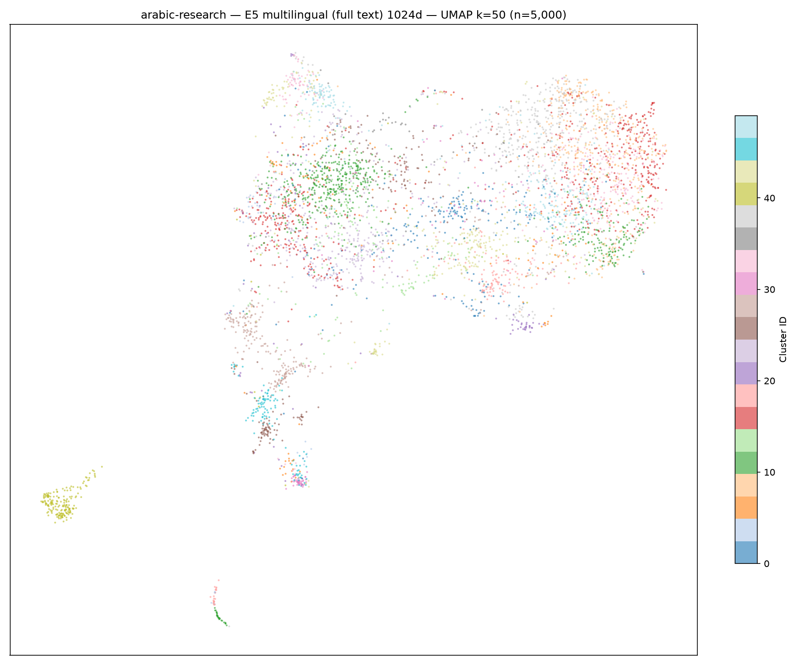
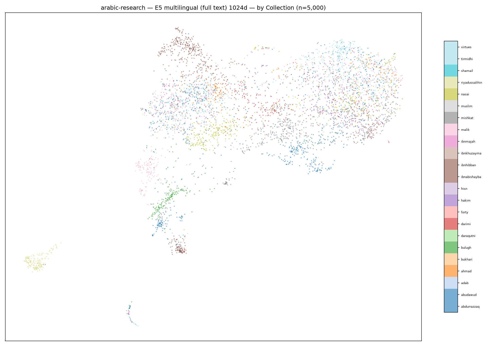
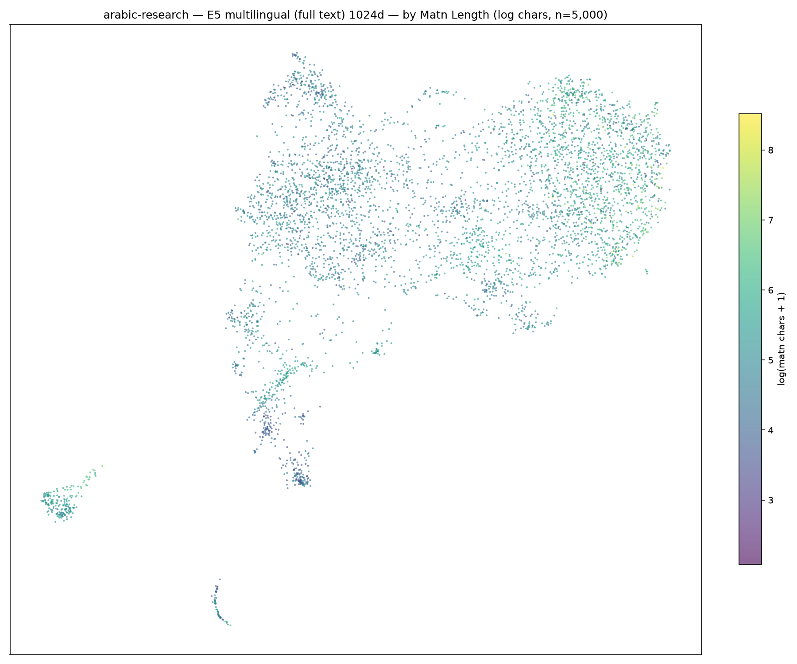
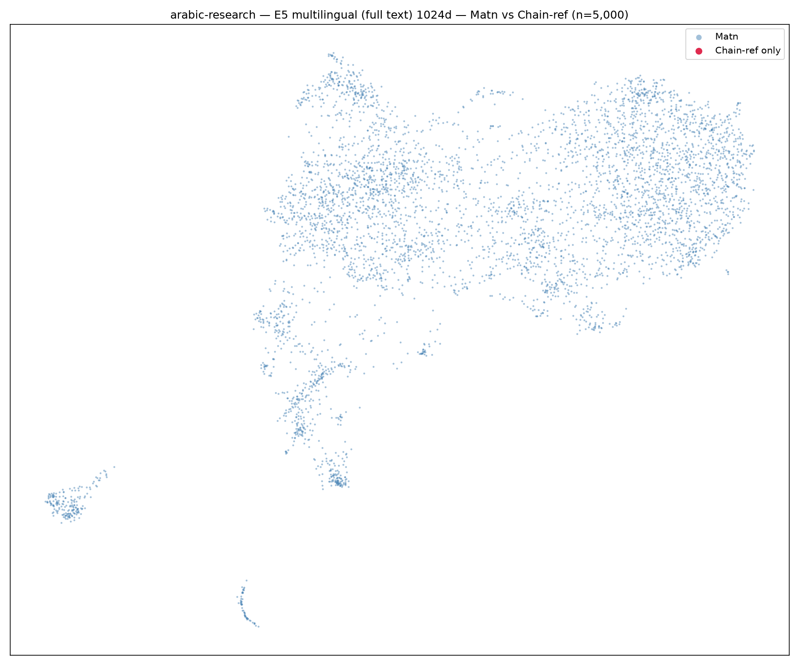
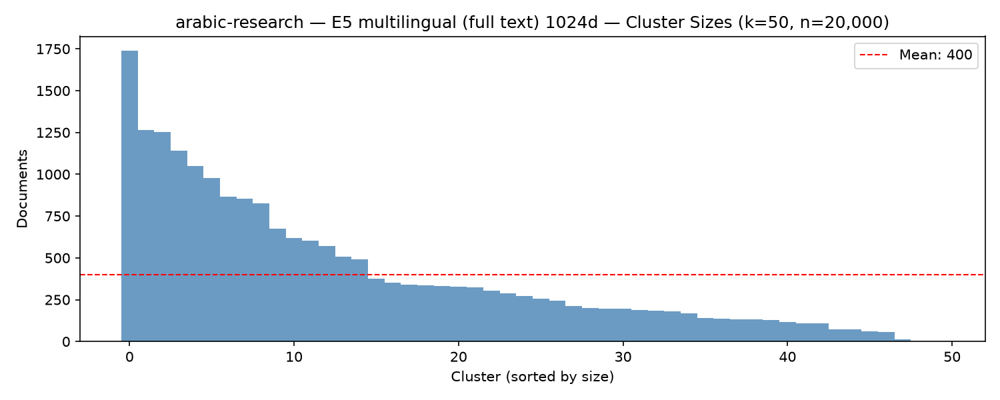
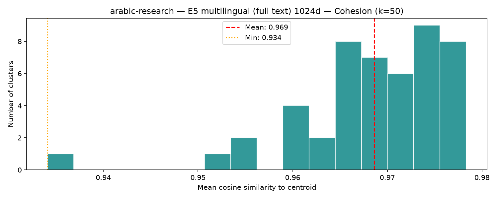

# arabic-research · vec_e5_full · k=50 Cluster Report

*2026-06-22 · 131,728 docs · 50 clusters · mean cohesion 0.970*

## Visualizations

| UMAP (by cluster) | UMAP (by collection) |
|---|---|
|  |  |

| UMAP (by matn length) | UMAP (matn vs chain-ref) |
|---|---|
|  |  |

| Cluster sizes | Cohesion distribution |
|---|---|
|  |  |

---

## 🏝️ Isolated Islands

These two clusters appear as geometrically isolated sub-clouds in the UMAP projection,
far from the main hadith mass. Both are pure Matn (no chain-refs) — likely highly
specialised textual registers.

> **🏝️ Left-strip island (1,589 docs)** — 1,589 docs · cohesion 0.960

### 🏝️ Island Cluster #41

**1,589 docs** · cohesion **0.960** · collections: riyadussalihin (1500) · ibnabishayba (53) · hisn (11) · virtues (9) · mishkat (7)

**[riyadussalihin 18](https://sunnah.com/hadith/1700180)** · *Uncategorized*

- وعن أبي عبد الرحمن عبد الله بن عمر بن الخطاب رضي الله عنهما عن النبي صلى الله عليه وسلم قال‏:‏ ‏"‏ إن الله عز وجل يقبل توبة العبد ما لم يغرغر‏"‏ ‏(‏‏(‏رواه الترمذي وقال‏:‏ حديث حسن‏)‏‏)‏‏.‏

**[riyadussalihin 1561](https://sunnah.com/hadith/1715510)** · *Uncategorized*

- وعن أبي هريرة رضي الله عنه أن رسول الله صلى الله عليه وسلم قال‏:‏ ‏"‏المتسابان ما قالا فعلى البادي منهما حتى يعتدي المظلوم‏"‏ ‏(‏‏(‏رواه مسلم‏)‏‏)‏‏.‏

**[riyadussalihin 1491](https://sunnah.com/hadith/1714810)** · *Uncategorized*

- وعن أنس رضي الله عنه قال‏:‏ قال رسول الله صلى الله عليه وسلم‏:‏ ‏"‏ألظوا بيا ذا الجلال والإكرام‏"‏‏.‏ رواه الترمذي ورواه النسائي من رواية ربيعة بن عامر الصحابي قال الحاكم حديث صحيح الإسناد‏.‏

**[riyadussalihin 1498](https://sunnah.com/hadith/1714880)** · *Uncategorized*

- وعن أبي هريرة رضي الله عنه أن رسول الله صلى الله عليه وسلم قال‏:‏ ‏"‏أقرب ما يكون العبد من ربه وهو ساجد، فأكثروا الدعاء‏"‏ ‏(‏‏(‏رواه مسلم‏)‏‏)‏‏.‏

**[riyadussalihin 1428](https://sunnah.com/hadith/1714180)** · *Uncategorized*

- وعن أبي هريرة رضي الله عنه أن رسول الله صلى الله عليه وسلم قال‏:‏ ‏"‏أقرب ما يكون العبد من ربه وهو ساجد، فأكثروا الدعاء‏"‏ ‏(‏‏(‏رواه مسلم‏)‏‏)‏‏.‏

---

> **🏝️ Bottom-left island (638 docs)** — 638 docs · cohesion 0.972

### 🏝️ Island Cluster #11

**638 docs** · cohesion **0.972** · collections: tirmidhi (220) · bukhari (179) · ibnmajah (112) · forty (30) · muslim (28)

**[tirmidhi 3125](https://sunnah.com/hadith/741421)** · *Sahih*

صلى الله عليه وسلم ‏"‏ مَا أَنْزَلَ اللَّهُ فِي التَّوْرَاةِ وَلاَ فِي الإِنْجِيلِ مِثْلَ أُمِّ الْقُرْآنِ وَهِيَ السَّبْعُ الْمَثَانِي وَهِيَ مَقْسُومَةٌ بَيْنِي وَبَيْنَ عَبْدِي وَلِعَبْدِي مَا سَأَلَ ‏"‏ ‏.‏ 
 
 
 حَدَّثَنَا قُتَيْبَةُ، حَدَّثَنَا عَبْدُ الْعَزِيزِ بْنُ مُحَمَّدٍ، عَنِ الْعَلاَءِ بْنِ عَبْدِ الرَّحْمَنِ، عَنْ أَبِيهِ، عَنْ أَبِي هُرَيْرَةَ، أَنَّ النَّبِيَّ صلى الله عليه وسلم خَرَجَ عَلَى أُبَىٍّ وَهُوَ يُصَلِّي فَذَكَرَ نَحْوَهُ بِمَعْنَاهُ ‏.‏ قَالَ أَبُو عِيسَى حَدِيثُ عَبْدِ الْعَزِيزِ بْنِ مُحَمَّدٍ أَطْوَلُ وَأَتَمُّ وَهَذَا أَصَحُّ مِنْ حَدِيثِ عَبْدِ الْحَمِيدِ بْنِ جَعْفَرٍ هَكَذَا رَوَى غَيْرُ وَاحِدٍ عَنِ الْعَلاَءِ بْنِ عَبْدِ الرَّحْمَنِ ‏.‏

**[tirmidhi 1081](https://sunnah.com/hadith/711020)** · *Sahih*

أَبُو عِيسَى كِلاَهُمَا صَحِيحٌ ‏.‏

**[bukhari 3414, 3415](https://sunnah.com/hadith/171960)** · *Sahih*

لاَ تُفَضِّلُوا بَيْنَ أَنْبِيَاءِ اللَّهِ، فَإِنَّهُ يُنْفَخُ فِي الصُّورِ، فَيَصْعَقُ مَنْ فِي السَّمَوَاتِ وَمَنْ فِي الأَرْضِ، إِلاَّ مَنْ شَاءَ اللَّهُ، ثُمَّ يُنْفَخُ فِيهِ أُخْرَى، فَأَكُونُ أَوَّلَ مَنْ بُعِثَ فَإِذَا [name role="nabi"]مُوسَى [/name]آخِذٌ بِالْعَرْشِ، فَلاَ أَدْرِي أَحُوسِبَ بِصَعْقَتِهِ يَوْمَ [place]الطُّورِ [/place]أَمْ بُعِثَ قَبْلِي -‏ وَلَا أَقُولُ إِنَّ أَحَدًا أَفْضَلُ مِنْ [name role="nabi"]يُونُسَ [/name]بْنِ مَتَّى"‏‏.‏

**[tirmidhi 2720](https://sunnah.com/hadith/729320)** · *Sahih*

أَبُو عِيسَى هَذَا حَدِيثٌ حَسَنٌ صَحِيحٌ ‏.‏

**[ibnmajah 1095](https://sunnah.com/hadith/1311471)** · *Hasan*

عَلَى الْمِنْبَرِ فِي يَوْمِ الْجُمُعَةِ ‏"‏ مَا عَلَى أَحَدِكُمْ لَوِ اشْتَرَى ثَوْبَيْنِ لِيَوْمِ الْجُمُعَةِ، سِوَى ثَوْبِ مِهْنَتِهِ ‏"‏ ‏.‏ 
 
 حَدَّثَنَا أَبُو بَكْرِ بْنُ أَبِي شَيْبَةَ، حَدَّثَنَا شَيْخٌ، لَنَا عَنْ عَبْدِ الْحَمِيدِ بْنِ جَعْفَرٍ، عَنْ مُحَمَّدِ بْنِ يَحْيَى بْنِ حَبَّانَ، عَنْ يُوسُفَ بْنِ عَبْدِ اللَّهِ بْنِ سَلاَمٍ، عَنْ أَبِيهِ، قَالَ خَطَبَنَا النَّبِيُّ ـ صلى الله عليه وسلم ـ ‏.‏ فَذَكَرَ ذَلِكَ ‏.‏

---

---

## 📚 All Clusters (by size)

- [#49 — 7,951 docs, coh=0.978](#cluster-49)
- [#12 — 7,475 docs, coh=0.978](#cluster-12)
- [#10 — 5,827 docs, coh=0.974](#cluster-10)
- [#37 — 5,587 docs, coh=0.976](#cluster-37)
- [#8 — 5,499 docs, coh=0.972](#cluster-8)
- [#1 — 4,898 docs, coh=0.976](#cluster-1)
- [#26 — 4,773 docs, coh=0.975](#cluster-26)
- [#15 — 4,762 docs, coh=0.974](#cluster-15)
- [#23 — 4,646 docs, coh=0.976](#cluster-23)
- [#16 — 4,167 docs, coh=0.975](#cluster-16)
- [#33 — 3,932 docs, coh=0.972](#cluster-33)
- [#32 — 3,709 docs, coh=0.975](#cluster-32)
- [#24 — 3,594 docs, coh=0.967](#cluster-24)
- [#48 — 3,545 docs, coh=0.978](#cluster-48)
- [#9 — 3,497 docs, coh=0.968](#cluster-9)
- [#25 — 3,191 docs, coh=0.962](#cluster-25)
- [#31 — 3,089 docs, coh=0.969](#cluster-31)
- [#18 — 3,049 docs, coh=0.964](#cluster-18)
- [#6 — 2,860 docs, coh=0.955](#cluster-6)
- [#7 — 2,706 docs, coh=0.968](#cluster-7)
- [#44 — 2,651 docs, coh=0.955](#cluster-44)
- [#13 — 2,624 docs, coh=0.972](#cluster-13)
- [#17 — 2,318 docs, coh=0.974](#cluster-17)
- [#36 — 2,292 docs, coh=0.971](#cluster-36)
- [#29 — 2,290 docs, coh=0.967](#cluster-29)
- [#20 — 2,204 docs, coh=0.967](#cluster-20)
- [#0 — 2,171 docs, coh=0.960](#cluster-0)
- [#46 — 2,170 docs, coh=0.971](#cluster-46)
- [#39 — 1,964 docs, coh=0.966](#cluster-39)
- [#47 — 1,933 docs, coh=0.970](#cluster-47)
- [#42 — 1,868 docs, coh=0.976](#cluster-42)
- [#43 — 1,717 docs, coh=0.974](#cluster-43)
- [#30 — 1,656 docs, coh=0.979](#cluster-30)
- [#5 — 1,604 docs, coh=0.972](#cluster-5)
- [🏝️ Island: #41 — 1,589 docs, coh=0.960](#cluster-41)
- [#3 — 1,544 docs, coh=0.977](#cluster-3)
- [#27 — 1,313 docs, coh=0.962](#cluster-27)
- [#38 — 1,309 docs, coh=0.967](#cluster-38)
- [#34 — 1,295 docs, coh=0.969](#cluster-34)
- [#22 — 1,252 docs, coh=0.963](#cluster-22)
- [#2 — 954 docs, coh=0.970](#cluster-2)
- [#14 — 928 docs, coh=0.951](#cluster-14)
- [#45 — 904 docs, coh=0.957](#cluster-45)
- [#19 — 746 docs, coh=0.969](#cluster-19)
- [🏝️ Island: #11 — 638 docs, coh=0.972](#cluster-11)
- [#21 — 435 docs, coh=0.968](#cluster-21)
- [#40 — 406 docs, coh=0.933](#cluster-40)
- [#4 — 194 docs, coh=0.967](#cluster-4)
- [#28 — 1 docs, coh=1.000](#cluster-28)
- [#35 — 1 docs, coh=1.000](#cluster-35)

---

### Cluster #49

**7,951 docs** · cohesion **0.978** · collections: hakim (3387) · ibnhibban (1834) · daraqutni (946) · ibnkhuzayma (821) · nasai (256)

**[hakim](https://sunnah.com/hadith/6817250)** · *Uncategorized*

" مَعَاذَ اللَّهِ ، أَنْ أَرُدَّ شَيْئًا نَفَّلَنِيهِ رَسُولُ اللَّهِ صَلَّى اللَّهُ عَلَيْهِ وَسَلَّمَ " ، فَلَمْ يَرُدَّ إِلَيْهِمْ شَيْئًا

**[hakim](https://sunnah.com/hadith/6845620)** · *Uncategorized*

إِنَّ لَكَ كَنْزًا فِي الْجَنَّةِ ، وَإِنَّكَ ذُو قَرْنَيْهَا ، فَلا تُتْبِعَنَّ النَّظْرَةَ نَظْرَةً ، فَإِنَّ لَكَ الأُولَى وَلَيْسَتْ لَكَ الآخِرَةُ "

**[hakim](https://sunnah.com/hadith/6848870)** · *Uncategorized*

" نَحْنُ بَنُو عَبْدِ الْمُطَّلِبِ سَادَةُ أَهْلِ الْجَنَّةِ : أَنَا وَعَلِيٌّ ، وَجَعْفَرٌ ، وَحَمْزَةُ ، وَالْحَسَنُ ، وَالْحُسَيْنُ ، وَالْمَهْدِيُّ "

**[ibnhibban](https://sunnah.com/hadith/6633660)** · *Uncategorized*

" اللَّهُمَّ بَارِكْ لَنَا فِي صَاعِنَا ، وَبَارِكْ لَنَا فِي قَلِيلِنَا وَكَثِيرِنَا ، وَاجْعَلْ لَنَا مَعَ الْبَرَكَةِ بَرَكَتَيْنِ "

**[ibnhibban](https://sunnah.com/hadith/6664070)** · *Uncategorized*

" مَا هَمَمْتُ بِقَبِيحٍ مِمَّا يَهُمُّ بِهِ أَهْلُ الْجَاهِلِيَّةِ إِِلا مَرَّتَيْنِ مِنَ الدَّهْرِ ، كِلْتَاهُمَا عَصَمَنِي اللَّهُ مِنْهُمَا ، قُلْتُ لَيْلَةً لِفَتًى كَانَ مَعِي مِنْ قُرَيْشٍ بِأَعْلَى مَكَّةَ فِي غَنَمٍ لأَهْلِنَا نَرْعَاهَا : أَبْصِرْ لِي غَنَمِي حَتَّى أَسْمُرَ هَذِهِ اللَّيْلَةَ بِمَكَّةَ كَمَا يَسْمُرُ الْفِتْيَانُ ، قَالَ : نَعَمْ ، فَخَرَجْتُ ، فَلَمَّا جِئْتُ أَدْنَى دَارٍ مِنْ دُورِ مَكَّةَ سَمِعْتُ غِنَاءً ، وَصَوْتَ دُفُوفٍ ، وَمَزَامِيرَ ، قُلْتُ : مَا هَذَا ؟ قَالُوا : فُلانٌ تَزَوَّجَ فُلانَةَ ، لِرَجُلٍ مِنْ قُرَيْشِ تَزَوَّجَ امْرَأَةً مِنْ قُرَيْشٍ ، فَلَهَوْتُ بِذَلِكَ الْغِنَاءِ ، وَبِذَلِكَ الصَّوْتِ حَتَّى غَلَبَتْنِي عَيْنِي ، فَنِمْتُ ، فَمَا أَيْقَظَنِي إِِلا مَسُّ الشَّمْسِ ، فَرَجَعْتُ إِِلَى صَاحِبِي ، فَقَالَ : مَا فَعَلْتَ ؟ فَأَخْبَرْتُهُ ، ثُمَّ فَعَلْتُ لَيْلَةً أُخْرَى مِثْلَ ذَلِكَ ، فَخَرَجْتُ ، فَسَمِعْتُ مِثْلَ ذَلِكَ ، فَقِيلَ لِي : مِثْلُ مَا قِيلَ لِي ، فَسَمِعْتُ كَمَا سَمِعْتُ ، حَتَّى غَلَبَتْنِي عَيْنِي ، فَمَا أَيْقَظَنِي إِِلا مَسُّ الشَّمْسِ ، ثُمَّ رَجَعْتُ إِِلَى صَاحِبِي ، فَقَالَ لِي : مَا فَعَلْتَ ؟ فَقُلْتُ : مَا فَعَلْتُ شَيْئًا " ، قَالَ رَسُولُ اللَّهِ صَلَّى اللَّهُ عَلَيْهِ وَسَلَّمَ : " فَوَاللَّهِ ، مَا هَمَمْتُ بَعْدَهُمَا بِسُوءٍ مِمَّا يَعْمَلُهُ أَهْلُ الْجَاهِلِيَّةِ ، حَتَّى أَكْرَمَنِي اللَّهُ بِنُبُوَّتِهِ "

---

### Cluster #12

**7,475 docs** · cohesion **0.978** · collections: muslim (1476) · ibnmajah (1365) · bukhari (1348) · abudawud (1297) · ahmad (515)

**[abudawud 4162](https://sunnah.com/hadith/941650)** · *Sahih*

كَانَتْ لِلنَّبِيِّ صلى الله عليه وسلم سُكَّةٌ يَتَطَيَّبُ مِنْهَا ‏.‏

**[ahmad 1102](https://sunnah.com/hadith/5310470)** · *Hasan*

نَهَانِي رَسُولُ اللَّهِ صَلَّى اللَّهُ عَلَيْهِ وَسَلَّمَ عَنْ خَاتَمِ الذَّهَبِ وَعَنْ الْمِيثَرَةِ وَعَنْ الْقَسِّيِّ وَعَنْ الْجِعَةِ‏.‏

**[ahmad 939](https://sunnah.com/hadith/5308950)** · *Sahih*

نَهَانِي رَسُولُ اللَّهِ صَلَّى اللَّهُ عَلَيْهِ وَسَلَّمَ عَنْ خَاتَمِ الذَّهَبِ وَعَنْ لُبْسِ الْحَمْرَاءِ وَعَنْ الْقِرَاءَةِ فِي الرُّكُوعِ وَالسُّجُودِ‏.‏

**[abudawud 1106](https://sunnah.com/hadith/911090)** · *Sahih*

أَمَرَنَا رَسُولُ اللَّهِ صلى الله عليه وسلم بِإِقْصَارِ الْخُطَبِ ‏.‏

**[ibnmajah 479](https://sunnah.com/hadith/1305160)** · *Hasan*

ـ صلى الله عليه وسلم ـ ‏"‏ إِذَا مَسَّ أَحَدُكُمْ ذَكَرَهُ فَلْيَتَوَضَّأْ ‏"‏ ‏.‏

---

### Cluster #10

**5,827 docs** · cohesion **0.974** · collections: ibnhibban (1858) · hakim (1250) · ibnabishayba (673) · abdurrazzaq (475) · ibnkhuzayma (428)

**[ibnhibban](https://sunnah.com/hadith/6637880)** · *Uncategorized*

اللَّهَ فَرَضَ عَلَيْكُمُ الْحَجَّ " ، فَقَامَ رَجُلٌ ، فَقَالَ : أَوَفِي كُلِّ عَامٍ ؟ حَتَّى قَالَ ذَلِكَ ثَلاثَ مَرَّاتٍ ، وَرَسُولُ اللَّهِ يَعْرِضُ عَنْهُ ، ثُمَّ قَالَ : " لَوْ قُلْتُ : نَعَمْ ، لَوَجَبَتْ ، وَلَوْ وَجَبَتْ لَمَا قُمْتُمْ بِهِ " ، ثُمَّ قَالَ : " ذَرُونِي مَا تَرَكْتُكُمْ ، فَإِنَّمَا هَلَكَ مَنْ كَانَ قَبْلَكُمْ بِسُؤَالِهِمْ ، وَاخْتِلافِهِمْ عَلَى أَنْبِيَائِهِمْ ، فَمَا أَمَرْتُكُمْ مِنْ شَيْءٍ ، فَأْتُوا مِنْهُ مَا اسْتَطَعْتُمْ ، وَمَا نَهَيْتُكُمْ مِنْ شَيْءٍ فَاجْتَنِبُوهُ "

**[ibnhibban](https://sunnah.com/hadith/6655050)** · *Uncategorized*

اسْتَأْذَنْتُ فِي الاسْتِغْفَارِ لأُمِّي ، فَلَمْ يَأْذَنْ لِي ، فَدَمَعَتْ عَيْنِي رَحْمَةً لَهَا مِنَ النَّارِ ، وَإِنِّي كُنْتُ نَهَيْتُكُمْ عَنْ ثَلاثٍ : عَنْ زِيَارَةِ الْقُبُورِ ، فَزُورُوهَا ، وَلْتَزِدْكُمْ زِيَارَتُهَا خَيْرًا ، وَإِنِّي كُنْتُ نَهَيْتُكُمْ عَنْ لُحُومِ الأَضَاحِي بَعْدَ ثَلاثٍ ، فَكُلُوا وَأَمْسِكُوا مَا شِئْتُمْ ، وَإِنِّي كُنْتُ نَهَيْتُكُمْ عَنِ الأَشْرِبَةِ فِي الأَوْعِيَةِ ، فَاشْرَبُوا فِي أَيِّ وِعَاءٍ شِئْتُمْ ، وَلا تَشْرَبُوا مُسْكِرًا "

**[ibnhibban](https://sunnah.com/hadith/6666620)** · *Uncategorized*

" هَلْ لَكَ أَنْ أُرِيَكَ آيَةً " ، وَعِنْدَهُ نَخْلٌ وَشَجَرٌ ، فَدَعَا رَسُولُ اللَّهِ صَلَّى اللَّهُ عَلَيْهِ وَسَلَّمَ عِذْقًا مِنْهَا ، فَأَقْبَلَ إِِلَيْهِ وَهُوَ يَسْجُدُ ، وَيَرْفَعُ رَأْسَهُ وَيَسْجُدُ ، وَيَرْفَعُ رَأْسَهُ حَتَّى انْتَهَى إِِلَيْهِ صَلَّى اللَّهُ عَلَيْهِ وَسَلَّمَ ، فَقَامَ بَيْنَ يَدَيْهِ ، ثُمَّ قَالَ لَهُ صَلَّى اللَّهُ عَلَيْهِ وَسَلَّمَ : ارْجِعْ إِِلَى مَكَانِكَ ، فَقَالَ الْعَامِرِيُّ : وَاللَّهِ لا أُكَذِّبُكَ بِشَيْءٍ تَقُولُهُ أَبَدًا ، ثُمَّ قَالَ : يَا آلَ عَامِرِ بْنِ صَعْصَعَةَ ، وَاللَّهِ لا أُكَذِّبُهُ بِشَيْءٍ "

**[hakim](https://sunnah.com/hadith/6800310)** · *Uncategorized*

مَا الإِيمَانُ ؟ قَالَ : " إِذَا سَرَّتْكَ حَسَنَتُكَ وَسَاءَتْكَ سَيِّئَتُكَ فَأَنْتَ مُؤْمِنٌ " , فَقَالَ : يَا رَسُولَ اللَّهِ , مَا الإِثْمُ ؟ , قَالَ : " إِذَا حَاكَ فِي صَدْرِكَ شَيْءٌ فَدَعْهُ "

**[ibnhibban](https://sunnah.com/hadith/6652130)** · *Uncategorized*

" هَلْ لَكَ بَنُونَ سِوَاهُ ؟ " قَالَ : نَعَمْ ، قَالَ : فَكُلُّهُمْ أَعْطَيْتَهُمْ مِثْلَ مَا أَعْطَيْتَ هَذَا ؟ " قَالَ : لا ، قَالَ : " فَلا تُشْهِدْنِي عَلَى جَوْرٍ "

---

### Cluster #37

**5,587 docs** · cohesion **0.976** · collections: tirmidhi (1100) · hakim (1043) · muslim (868) · abudawud (565) · bukhari (406)

**[hakim](https://sunnah.com/hadith/6825270)** · *Uncategorized*

" يُنَفِّلُ الثُّلُثَ بَعْدَ الْخُمُسِ "

**[hakim](https://sunnah.com/hadith/6822190)** · *Uncategorized*

" عَنْ عَسْبِ الْفَحْلِ "

**[hakim](https://sunnah.com/hadith/6876140)** · *Uncategorized*

" خَيْرُ الضَّحِيَّةِ الْكَبْشُ الأَقْرَنُ ، وَخَيْرُ الْكَفَنِ الْحُلَّةُ "

**[ibnmajah 233](https://sunnah.com/hadith/1302380)** · *Sahih*

‏"‏ لِيُبَلِّغِ الشَّاهِدُ الْغَائِبَ فَإِنَّهُ رُبَّ مُبَلَّغٍ يُبَلَّغُهُ أَوْعَى لَهُ مِنْ سَامِعٍ ‏"‏ ‏.‏

**[abudawud 2410](https://sunnah.com/hadith/924130)** · *Da'if*

صلى الله عليه وسلم ‏"‏ مَنْ كَانَتْ لَهُ حَمُولَةٌ تَأْوِي إِلَى شِبَعٍ فَلْيَصُمْ رَمَضَانَ حَيْثُ أَدْرَكَهُ ‏"‏ ‏.‏

---

### Cluster #8

**5,499 docs** · cohesion **0.972** · collections: tirmidhi (1014) · bukhari (983) · muslim (868) · abudawud (682) · ibnabishayba (346)

**[bukhari 4399](https://sunnah.com/hadith/140290)** · *Sahih*

فَرِيضَةَ اللَّهِ عَلَى عِبَادِهِ أَدْرَكَتْ أَبِي شَيْخًا كَبِيرًا لاَ يَسْتَطِيعُ أَنْ يَسْتَوِيَ عَلَى الرَّاحِلَةِ، فَهَلْ يَقْضِي أَنْ أَحُجَّ عَنْهُ قَالَ ‏"‏ نَعَمْ ‏"

**[ibnmajah 1270](https://sunnah.com/hadith/1313280)** · *Uncategorized*

يَا رَسُولَ اللَّهِ لَقَدْ جِئْتُكَ مِنْ عِنْدِ قَوْمٍ مَا يَتَزَوَّدُ لَهُمْ رَاعٍ وَلاَ يَخْطِرُ لَهُمْ فَحْلٌ ‏.‏ فَصَعِدَ الْمِنْبَرَ فَحَمِدَ اللَّهَ ثُمَّ قَالَ ‏"‏ اللَّهُمَّ اسْقِنَا غَيْثًا مُغِيثًا مَرِيئًا طَبَقًا مَرِيعًا غَدَقًا عَاجِلاً غَيْرَ رَائِثٍ ‏"‏ ‏.‏ ثُمَّ نَزَلَ فَمَا يَأْتِيهِ أَحَدٌ مِنْ وَجْهٍ مِنَ الْوُجُوهِ إِلاَّ قَالُوا قَدْ أُحْيِينَا ‏.‏

**[muslim 1021 c](https://sunnah.com/hadith/324070)** · *Sahih*

‏"‏ فَيَجْهَدُ أَنْ يُوَسِّعَهَا فَلاَ يَسْتَطِيعُ ‏"‏ ‏.‏

**[abudawud 2131](https://sunnah.com/hadith/921340)** · *Da'if*

صلى الله عليه وسلم ‏"‏ لَهَا الصَّدَاقُ بِمَا اسْتَحْلَلْتَ مِنْ فَرْجِهَا وَالْوَلَدُ عَبْدٌ لَكَ فَإِذَا وَلَدَتْ ‏"‏ ‏.‏ قَالَ الْحَسَنُ ‏"‏ فَاجْلِدْهَا ‏"‏ ‏.‏ وَقَالَ ابْنُ أَبِي السَّرِيِّ ‏"‏ فَاجْلِدُوهَا ‏"‏ ‏.‏ أَوْ قَالَ ‏"‏ فَحُدُّوهَا ‏"‏ ‏.‏ قَالَ أَبُو دَاوُدَ رَوَى هَذَا الْحَدِيثَ قَتَادَةُ عَنْ سَعِيدِ بْنِ يَزِيدَ عَنِ ابْنِ الْمُسَيَّبِ وَرَوَاهُ يَحْيَى بْنُ أَبِي كَثِيرٍ عَنْ يَزِيدَ بْنِ نُعَيْمٍ عَنْ سَعِيدِ بْنِ الْمُسَيَّبِ وَعَطَاءٌ الْخُرَاسَانِيُّ عَنْ سَعِيدِ بْنِ الْمُسَيَّبِ أَرْسَلُوهُ كُلُّهُمْ ‏.‏ وَفِي حَدِيثِ يَحْيَى بْنِ أَبِي كَثِيرٍ أَنَّ بَصْرَةَ بْنَ أَكْثَمَ نَكَحَ امْرَأَةً وَكُلُّهُمْ قَالَ فِي حَدِيثِهِ جَعَلَ الْوَلَدَ عَبْدًا لَهُ ‏.‏

**[bukhari 4026](https://sunnah.com/hadith/136630)** · *Sahih*

"‏ هَلْ وَجَدْتُمْ مَا وَعَدَكُمْ رَبُّكُمْ حَقًّا ‏"‏‏.‏ قَالَ [narrator id="7756" role="chain" tooltip="موسى بن عقبة القرشي"]مُوسَى[/narrator] قَالَ [narrator id="7863" role="chain" tooltip="نافع مولى ابن عمر"]نَافِعٌ[/narrator] قَالَ [narrator id="4967" role="sahabi" tooltip="عبد الله بن عمر العدوي"]عَبْدُ اللَّهِ[/narrator] قَالَ نَاسٌ مِنْ أَصْحَابِهِ يَا رَسُولَ اللَّهِ تُنَادِي نَاسًا أَمْوَاتًا قَالَ رَسُولُ اللَّهِ صلى الله عليه وسلم ‏"‏ مَا أَنْتُمْ بِأَسْمَعَ لِمَا قُلْتُ مِنْهُمْ ‏"

---

### Cluster #1

**4,898 docs** · cohesion **0.976** · collections: ibnhibban (2372) · darimi (824) · hakim (691) · nasai (544) · abdurrazzaq (166)

**[ibnhibban](https://sunnah.com/hadith/6652380)** · *Uncategorized*

" الْعُمْرَى لِمَنْ أَُعْمِرَهَا ، وَالرُّقْبَى لَمْ أَُرْقِيَهَا "

**[hakim](https://sunnah.com/hadith/6880770)** · *Uncategorized*

" اللَّهُ وَرَسُولُهُ مَوْلَى مَنْ لا مَوْلَى لَهُ ، وَالْخَالُ وَارِثُ مَنْ لا وَارِثَ لَهُ "

**[ibnhibban](https://sunnah.com/hadith/6622980)** · *Uncategorized*

" صَلَّى لَنَا رَسُولُ اللَّهِ صَلَّى اللَّهُ عَلَيْهِ وَسَلَّمَ "

**[ibnhibban](https://sunnah.com/hadith/6643650)** · *Uncategorized*

" طَلَّقَ حَفْصَةُ ، ثُمَّ رَاجَعَهَا "

**[nasai 3560](https://sunnah.com/hadith/1135730)** · *Sahih*

عَمْرٌو إِنَّ رَسُولَ اللَّهِ صلى الله عليه وسلم - كَانَ طَلَّقَ حَفْصَةَ ثُمَّ رَاجَعَهَا ‏.‏ وَاللَّهُ أَعْلَمُ ‏.‏

---

### Cluster #26

**4,773 docs** · cohesion **0.975** · collections: ibnabishayba (2799) · daraqutni (469) · hakim (445) · darimi (263) · ibnhibban (217)

**[daraqutni](https://sunnah.com/hadith/7815420)** · *Uncategorized*

عَنْ ضَرْبِ الْمُصَلِّينَ "

**[ibnhibban](https://sunnah.com/hadith/6628790)** · *Uncategorized*

نُصَلِّي مَعَ رَسُولِ اللَّهِ صَلَّى اللَّهُ عَلَيْهِ وَسَلَّمَ ، الْجُمُعَةَ ، ثُمَّ نَرْجِعُ ، فَنَقِيلُ "

**[daraqutni](https://sunnah.com/hadith/7817790)** · *Uncategorized*

اتَّقُوا النَّارَ وَلَوْ بِشِقِّ تَمْرَةٍ , فَإِنَّهَا تَشُدُّ مِنَ الْجَائِعِ مَا تَشُدُّ مِنَ الشَّبْعَانِ "

**[hakim](https://sunnah.com/hadith/6881420)** · *Uncategorized*

" الشَّيْخُ وَالشَّيْخَةُ إِذَا زَنَيَا فَارْجُمُوهُمَا الْبَتَّةَ "

**[ibnabishayba](https://sunnah.com/hadith/7453185)** · *Uncategorized*

" لَقِّنُوا مَوْتَاكُمْ لَا إلَهَ إلَّا اللَّهُ "

---

### Cluster #15

**4,762 docs** · cohesion **0.974** · collections: bukhari (667) · muslim (520) · nasai (506) · abudawud (411) · ahmad (371)

**[hakim](https://sunnah.com/hadith/6868980)** · *Uncategorized*

فَلَمَّا دَخَلَ النَّبِيُّ صَلَّى اللَّهُ عَلَيْهِ وَآَلِهِ وَسَلَّمَ قَبْرَهَا ، خَرَجَ مُلْتَمِعَ اللَّوْنِ ، وَسَأَلْنَاهُ عَنْ ذَلِكَ ، فَقَالَ : " إِنَّهَا كَانَتِ امْرَأَةً مِسْقَامَةً ، فَذَكَرْتُ شِدَّةَ الْمَوْتِ وَضَمَّةَ الْقَبْرِ ، فَدَعَوْتُ اللَّهَ أَنْ يُخَفِّفَ عَنْهَا "

**[nasai 2438](https://sunnah.com/hadith/1124470)** · *Hasan*

‏"‏ وَالَّذِي نَفْسِي بِيَدِهِ ‏"‏ ‏.‏ ثَلاَثَ مَرَّاتٍ ثُمَّ أَكَبَّ فَأَكَبَّ كُلُّ رَجُلٍ مِنَّا يَبْكِي لاَ نَدْرِي عَلَى مَاذَا حَلَفَ ثُمَّ رَفَعَ رَأْسَهُ فِي وَجْهِهِ الْبُشْرَى فَكَانَتْ أَحَبَّ إِلَيْنَا مِنْ حُمْرِ النَّعَمِ ثُمَّ قَالَ ‏"‏ مَا مِنْ عَبْدٍ يُصَلِّي الصَّلَوَاتِ الْخَمْسَ وَيَصُومُ رَمَضَانَ وَيُخْرِجُ الزَّكَاةَ وَيَجْتَنِبُ الْكَبَائِرَ السَّبْعَ إِلاَّ فُتِّحَتْ لَهُ أَبْوَابُ الْجَنَّةِ فَقِيلَ لَهُ ادْخُلْ بِسَلاَمٍ ‏"‏ ‏.‏

**[tirmidhi 189](https://sunnah.com/hadith/701890)** · *Hasan*

صلى الله عليه وسلم ‏"‏ فَلِلَّهِ الْحَمْدُ فَذَلِكَ أَثْبَتُ ‏"‏ ‏.‏ قَالَ وَفِي الْبَابِ عَنِ ابْنِ عُمَرَ ‏.‏ قَالَ أَبُو عِيسَى حَدِيثُ عَبْدِ اللَّهِ بْنِ زَيْدٍ حَدِيثٌ حَسَنٌ صَحِيحٌ ‏.‏ وَقَدْ رَوَى هَذَا الْحَدِيثَ إِبْرَاهِيمُ بْنُ سَعْدٍ عَنْ مُحَمَّدِ بْنِ إِسْحَاقَ أَتَمَّ مِنْ هَذَا الْحَدِيثِ وَأَطْوَلَ وَذَكَرَ فِيهِ قِصَّةَ الأَذَانِ مَثْنَى مَثْنَى وَالإِقَامَةِ مَرَّةً مَرَّةً ‏.‏ وَعَبْدُ اللَّهِ بْنُ زَيْدٍ هُوَ ابْنُ عَبْدِ رَبِّهِ وَيُقَالُ ابْنُ عَبْدِ رَبٍّ وَلاَ نَعْرِفُ لَهُ عَنِ النَّبِيِّ صلى الله عليه وسلم شَيْئًا يَصِحُّ إِلاَّ هَذَا الْحَدِيثَ الْوَاحِدَ فِي الأَذَانِ ‏.‏ وَعَبْدُ اللَّهِ بْنُ زَيْدِ بْنِ عَاصِمٍ الْمَازِنِيُّ لَهُ أَحَادِيثُ عَنِ النَّبِيِّ صلى الله عليه وسلم وَهُوَ عَمُّ عَبَّادِ بْنِ تَمِيمٍ ‏.‏

**[abudawud 5233](https://sunnah.com/hadith/952360)** · *Hasan*

أَبُو دَاوُدَ أَبُو عَبْدِ الرَّحْمَنِ الْفِهْرِيُّ لَيْسَ لَهُ إِلاَّ هَذَا الْحَدِيثُ وَهُوَ حَدِيثٌ نَبِيلٌ جَاءَ بِهِ حَمَّادُ بْنُ سَلَمَةَ ‏.‏

**[muslim 964 c](https://sunnah.com/hadith/322800)** · *Sahih*

فَقَامَ عَلَيْهَا لِلصَّلاَةِ وَسَطَهَا ‏.‏

---

### Cluster #23

**4,646 docs** · cohesion **0.976** · collections: nasai (2103) · muslim (881) · bukhari (588) · abudawud (298) · ibnmajah (269)

**[nasai 5707](https://sunnah.com/hadith/1156930)** · *Da'if*

كَانَ النَّبِيذُ الَّذِي يَشْرَبُهُ عُمَرُ بْنُ الْخَطَّابِ قَدْ خُلِّلَ ‏.‏ وَمِمَّا يَدُلُّ عَلَى صِحَّةِ هَذَا حَدِيثُ السَّائِبِ ‏.‏

**[nasai 4261](https://sunnah.com/hadith/1142760)** · *Uncategorized*

‏"‏ مَا كَانَ عَلَى أَهْلِ هَذِهِ الشَّاةِ لَوِ انْتَفَعُوا بِإِهَابِهَا ‏"‏ ‏.‏

**[nasai 5174](https://sunnah.com/hadith/1151590)** · *Sahih*

نَهَانِي رَسُولُ اللَّهِ صلى الله عليه وسلم عَنِ الْقِرَاءَةِ وَأَنَا رَاكِعٌ وَعَنْ لُبْسِ الذَّهَبِ وَالْمُعَصْفَرِ ‏.‏

**[bukhari 3863](https://sunnah.com/hadith/134980)** · *Sahih*

مَا زِلْنَا أَعِزَّةً مُنْذُ أَسْلَمَ عُمَرُ‏.‏

**[tirmidhi 1540](https://sunnah.com/hadith/716210)** · *Sahih*

أَبُو عِيسَى هَذَا حَدِيثٌ حَسَنٌ صَحِيحٌ ‏.‏

---

### Cluster #16

**4,167 docs** · cohesion **0.975** · collections: bukhari (902) · muslim (811) · ibnmajah (777) · abudawud (714) · nasai (374)

**[muslim 1002 a](https://sunnah.com/hadith/323680)** · *Sahih*

‏"‏ إِنَّ الْمُسْلِمَ إِذَا أَنْفَقَ عَلَى أَهْلِهِ نَفَقَةً وَهُوَ يَحْتَسِبُهَا كَانَتْ لَهُ صَدَقَةً ‏"‏ ‏.‏

**[ibnmajah 4009](https://sunnah.com/hadith/1341440)** · *Hasan*

ـ صلى الله عليه وسلم ـ ‏"‏ مَا مِنْ قَوْمٍ يُعْمَلُ فِيهِمْ بِالْمَعَاصِي هُمْ أَعَزُّ مِنْهُمْ وَأَمْنَعُ لاَ يُغَيِّرُونَ إِلاَّ عَمَّهُمُ اللَّهُ بِعِقَابٍ ‏"‏ ‏.‏

**[muslim 2790](https://sunnah.com/hadith/372710)** · *Sahih*

صلى الله عليه
 وسلم ‏"‏ يُحْشَرُ النَّاسُ يَوْمَ الْقِيَامَةِ عَلَى أَرْضٍ بَيْضَاءَ عَفْرَاءَ كَقُرْصَةِ النَّقِيِّ لَيْسَ فِيهَا
 عَلَمٌ لأَحَدٍ ‏"‏ ‏.‏

**[tirmidhi 1981](https://sunnah.com/hadith/721040)** · *Sahih*

‏"‏ الْمُسْتَبَّانِ مَا قَالاَ فَعَلَى الْبَادِي مِنْهُمَا مَا لَمْ يَعْتَدِ الْمَظْلُومُ ‏"‏ ‏.‏ وَفِي الْبَابِ عَنْ سَعْدٍ وَابْنِ مَسْعُودٍ وَعَبْدِ اللَّهِ بْنِ مُغَفَّلٍ ‏.‏ قَالَ أَبُو عِيسَى هَذَا حَدِيثٌ حَسَنٌ صَحِيحٌ ‏.‏

**[ibnmajah 923](https://sunnah.com/hadith/1309750)** · *Hasan*

ـ صلى الله عليه وسلم ـ ‏"‏ لاَ يَؤُمُّ عَبْدٌ فَيَخُصَّ نَفْسَهُ بِدَعْوَةٍ دُونَهُمْ فَإِنْ فَعَلَ فَقَدْ خَانَهُمْ ‏"‏ ‏.‏

---

### Cluster #33

**3,932 docs** · cohesion **0.972** · collections: bukhari (581) · nasai (471) · muslim (449) · ibnabishayba (371) · abudawud (307)

**[bukhari 4549, 4550](https://sunnah.com/hadith/178781)** · *Sahih*

مَنْ حَلَفَ يَمِينَ صَبْرٍ لِيَقْتَطِعَ بِهَا مَالَ امْرِئٍ مُسْلِمٍ، لَقِيَ اللَّهَ وَهْوَ عَلَيْهِ غَضْبَانُ ‏"‏‏.‏ فَأَنْزَلَ اللَّهُ تَصْدِيقَ ذَلِكَ ‏[quran sura="3" aya_start="77" aya_end="77"]{‏إِنَّ الَّذِينَ يَشْتَرُونَ بِعَهْدِ اللَّهِ وَأَيْمَانِهِمْ ثَمَنًا قَلِيلاً أُولَئِكَ لاَ خَلاَقَ لَهُمْ فِي الآخِرَةِ‏}[/quran]‏ إِلَى آخِرِ الآيَةِ‏.‏       قَالَ فَدَخَلَ [narrator id="583" role="sahabi" tooltip="أشعث بن قيس الكندي"]الأَشْعَثُ بْنُ قَيْسٍ[/narrator] وَقَالَ مَا يُحَدِّثُكُمْ أَبُو عَبْدِ الرَّحْمَنِ قُلْنَا كَذَا وَكَذَا‏.‏ قَالَ فِيَّ أُنْزِلَتْ كَانَتْ لِي بِئْرٌ فِي أَرْضِ ابْنِ عَمٍّ لِي قَالَ النَّبِيُّ صلى الله عليه وسلم ‏"‏ بَيِّنَتُكَ أَوْ يَمِينُهُ ‏"‏ فَقُلْتُ إِذًا يَحْلِفَ يَا رَسُولَ اللَّهِ‏.‏ فَقَالَ النَّبِيُّ صلى الله عليه وسلم ‏"‏ مَنْ حَلَفَ عَلَى يَمِينِ صَبْرٍ يَقْتَطِعُ بِهَا مَالَ امْرِئٍ مُسْلِمٍ وَهْوَ فِيهَا فَاجِرٌ، لَقِيَ اللَّهَ وَهْوَ عَلَيْهِ غَضْبَانٌ ‏"

**[bukhari 7468](https://sunnah.com/hadith/176450)** · *Sahih*

أُبَايِعُكُمْ عَلَى أَنْ لاَ تُشْرِكُوا بِاللَّهِ شَيْئًا، وَلاَ تَسْرِقُوا، وَلاَ تَزْنُوا، وَلاَ تَقْتُلُوا أَوْلاَدَكُمْ، وَلاَ تَأْتُوا بِبُهْتَانٍ تَفْتَرُونَهُ بَيْنَ أَيْدِيكُمْ وَأَرْجُلِكُمْ وَلاَ تَعْصُونِي فِي مَعْرُوفٍ، فَمَنْ وَفَى مِنْكُمْ فَأَجْرُهُ عَلَى اللَّهِ، وَمَنْ أَصَابَ مِنْ ذَلِكَ شَيْئًا فَأُخِذَ بِهِ فِي الدُّنْيَا فَهْوَ لَهُ كَفَّارَةٌ وَطَهُورٌ، وَمَنْ سَتَرَهُ اللَّهُ فَذَلِكَ إِلَى اللَّهِ إِنْ شَاءَ عَذَّبَهُ وَإِنْ شَاءَ غَفَرَ لَهُ ‏"

**[hakim](https://sunnah.com/hadith/6842860)** · *Uncategorized*

" لَيُدْرِكَنَّ الدَّجَّالُ قَوْمًا مِثْلَكُمْ أَوْ خَيْرًا مِنْكُمْ ، ثَلاثَ مَرَّاتٍ ، وَلَنْ يَخْزِيَ اللَّهُ أُمَّةً ، أَنَا أَوَّلُهَا ، وَعِيسَى بْنُ مَرْيَمَ آخِرُهَا "

**[ahmad 624](https://sunnah.com/hadith/5305900)** · *Sahih*

كُفَّ جَلَدَ رَسُولُ اللَّهِ صَلَّى اللَّهُ عَلَيْهِ وَسَلَّمَ أَرْبَعِينَ وَأَبُو بَكْرٍ أَرْبَعِينَ وَكَمَّلَهَا عُمَرُ ثَمَانِينَ وَكُلٌّ سُنَّةٌ‏.‏

**[ibnmajah 2656](https://sunnah.com/hadith/1327580)** · *Hasan*

رَسُولُ اللَّهِ صلى الله عليه وسلم ‏"‏ يَعْمِدُ أَحَدُكُمْ إِلَى أَخِيهِ فَيَعَضُّهُ كَعِضَاضِ الْفَحْلِ ثُمَّ يَأْتِي يَلْتَمِسُ الْعَقْلَ لاَ عَقْلَ لَهَا ‏"‏ ‏.‏ قَالَ فَأَبْطَلَهَا رَسُولُ اللَّهِ صلى الله عليه وسلم ‏.‏

---

### Cluster #32

**3,709 docs** · cohesion **0.975** · collections: ibnabishayba (3512) · ibnmajah (60) · muslim (44) · daraqutni (30) · hakim (11)

**[ibnabishayba](https://sunnah.com/hadith/7505520)** · *Uncategorized*

هُوَ أَحَقُّ بِهَا مَا لَمْ يَرْضَ مِنْهَا "

**[ibnabishayba](https://sunnah.com/hadith/7504700)** · *Uncategorized*

" هُوَ لِمَوْلَاهُ "

**[ibnabishayba](https://sunnah.com/hadith/7502640)** · *Uncategorized*

كَرِهَ نَهَّابَ السُّكْرِ عَلَى الصِّبْيَانِ "

**[ibnabishayba](https://sunnah.com/hadith/7430670)** · *Uncategorized*

" إِذَا كَانَ يَوْمُ الْغَيْمِ فَعَجِّلُوا الْعَصْرَ وَأَخِّرُوا الظُّهْرَ "

**[ibnabishayba](https://sunnah.com/hadith/7507700)** · *Uncategorized*

" لَا بَأْسَ بِبَيْعِ الْعَصِيرِ مَا لَمْ يَغْلِ "

---

### Cluster #24

**3,594 docs** · cohesion **0.967** · collections: ibnabishayba (2755) · darimi (156) · bukhari (103) · abdurrazzaq (87) · adab (62)

**[ibnabishayba](https://sunnah.com/hadith/7444985)** · *Uncategorized*

" لَا تَزَالُ هَذِهِ الْأُمَّةُ بِخَيْرٍ مَا عَجَّلُوا الْفِطْرَ فَإِذَا كَانَ يَوْمُ صَوْمِ أَحَدِكُمْ فَمَضْمَضَ فَاهُ ، فَلَا يَمُجَّهُ وَلَكِنْ لِيَشْرَبْهُ فَإِنَّ خَيْرَهُ أَوَّلُهُ "

**[bukhari 451](https://sunnah.com/hadith/104510)** · *Sahih*

أَمْسِكْ بِنِصَالِهَا ‏"

**[ibnabishayba](https://sunnah.com/hadith/7408830)** · *Uncategorized*

الْمُؤْمِنَ لَا يَنْجُسُ "

**[ibnabishayba](https://sunnah.com/hadith/7497510)** · *Uncategorized*

" إذَا أَفْلَسَ الرَّجُلُ فَوَجَدَ سِلْعَتَهُ قَائِمَةً بِعَيْنِهَا فَهُوَ أَحَقُّ بِهَا مِنَ الْغُرَمَاءِ "

**[ibnabishayba](https://sunnah.com/hadith/7437130)** · *Uncategorized*

" أَخَّرَ الْحَجَّاجُ الصَّلَاةَ بِعَرَفَةَ ، فَصَلَّى ابْنُ عُمَرَ فِي رَحْلِهِ ، وَثَمَّ نَاسٌ وُقُفٌ ، قَالَ : فَأَمَرَ بِهِ الْحَجَّاجُ فَنَخََسَ بِهِ "

---

### Cluster #48

**3,545 docs** · cohesion **0.978** · collections: ibnabishayba (3184) · hakim (88) · muslim (62) · ibnmajah (44) · daraqutni (44)

**[ibnabishayba](https://sunnah.com/hadith/7520715)** · *Uncategorized*

" نَهَى رَسُولُ اللَّهِ صَلَّى اللَّهُ عَلَيْهِ وَسَلَّمَ عَنِ الْمُعَصْفَرِ "

**[ibnabishayba](https://sunnah.com/hadith/7517600)** · *Uncategorized*

زَجَرَ رَسُولُ اللَّهِ صَلَّى اللَّهُ عَلَيْهِ وَسَلَّمَ رَجُلا شَرِبَ قَائِمًا "

**[ibnabishayba](https://sunnah.com/hadith/7425445)** · *Uncategorized*

النَّبِيُّ صَلَّى اللَّهُ عَلَيْهِ وَسَلَّمَ إذَا خَطَبَ اسْتَقْبَلَهُ أَصْحَابُهُ بِوُجُوهِهِمْ "

**[ibnabishayba](https://sunnah.com/hadith/7514640)** · *Uncategorized*

" رَخَّصَ رَسُولُ اللَّهِ صَلَّى اللَّهُ عَلَيْهِ وَسَلَّمَ فِي الرُّقْيَةِ مِنَ الْعَيْنِ وَالْحُمَةِ "

**[ibnabishayba](https://sunnah.com/hadith/7424215)** · *Uncategorized*

" نَهَى رَسُولُ اللَّهِ صَلَّى اللَّهُ عَلَيْهِ وَسَلَّمَ أَنْ يُوَطِّنَ الرَّجُلُ الْمَكَانَ يُصَلِّي فِيهِ كَمَا يُوَطِّنُ الْبَعِيرُ "

---

### Cluster #9

**3,497 docs** · cohesion **0.968** · collections: abdurrazzaq (1141) · ibnabishayba (1057) · hakim (280) · ibnhibban (169) · daraqutni (149)

**[hakim](https://sunnah.com/hadith/6863190)** · *Uncategorized*

" أَرَى الْقُرْآنَ قَدْ ظَهَرَ فِي النَّاسِ " ، فَقُلْتُ : مَا أُحِبُّ ذَاكَ يَا أَمِيرَ الْمُؤْمِنِينَ ، قَالَ : فَاجْتَذَبَ يَدَهُ مِنْ يَدَي ، وَقَالَ : " لِمَ قُلْتَ ؟ لأَنَّهُمْ مَتَى يَقْرَءُوا يَتَقَرُّوا ، وَمَتَى مَا يَتَقَرُّوا اخْتَلَفُوا ، وَمَتَى مَا يَخْتَلِفُوا يَضْرِبُ بَعْضُهُمْ رِقَابَ بَعْضٍ " ، فَقَالَ : فَجَلَسَ عَنِّي وَتَرَكَنِي ، فَظَلَلْتُ عَنْهُ يَوْمَ لا يَعْلَمُهُ إِلا اللَّهُ ، ثُمَّ أَتَانِي رَسُولُهُ الظُّهْرَ ، فَقَالَ : أَجِبْ أَمِيرَ الْمُؤْمِنِينَ فَأَتَيْتُهُ ، فَقَالَ : كَيْفَ قُلْتَ ؟ فَأَعَدْتُ مَقَالَتِي ، قَالَ عُمَرُ رَضِيَ اللَّهُ عَنْهُ : " إِنْ كُنْتُ لأَكْتُمُهَا النَّاسَ "

**[ibnhibban](https://sunnah.com/hadith/6603920)** · *Uncategorized*

ذُو الْكِفْلِ مِنْ بَنِي إِسْرَائِيلَ لا يَتَوَرَّعُ مِنْ شَيْءٍ ، فَهَوِيَ امْرَأَةً ، فَرَاوَدَهَا عَلَى نَفْسِهَا ، وَأَعْطَاهَا سِتِّينَ دِينَارًا ، فَلَمَّا جَلَسَ مِنْهَا ، بَكَتْ وَأُرْعِدَتْ ، فقَالَ لَهَا : مَا لَكِ ؟ فَقَالَتْ : إِنِّي وَاللَّهِ لَمْ أَعْمَلْ هَذَا الْعَمَلَ قَطُّ ، وَمَا عَمِلْتُهُ إِلا مِنْ حَاجَةٍ ، قَالَ : فَنَدِمَ ذُو الْكِفْلِ ، وَقَامَ مِنْ غَيْرِ أَنْ يَكُونَ مِنْهُ شَيْءٌ ، فَأَدْرَكَهُ الْمَوْتُ مِنْ لَيْلَتِهِ ، فَلَمَّا أَصْبَحَ ، وَجَدُوا عَلَى بَابِهِ مَكْتُوبًا : إِنَّ اللَّهَ قَدْ غَفَرَ لَكَ "

**[ibnabishayba](https://sunnah.com/hadith/7466640)** · *Uncategorized*

نِسْوَةً كُنَّ بِالشَّامِ فَأَشِرْنَ وَبَطَرْنَ وَلَعِبْنَ الْحُزَّقَةِ فَرَكِبَتْ وَاحِدَةٌ الْأُخْرَى وَنَخَسَتِ الْأُخْرَى فَأَذْهَبَتْ عُذْرَتَهَا ، فَرُفِعَ ذَلِكَ إلَى عَبْدِ الْمَلِكِ بْنِ مَرْوَانَ فَسَأَلَ عَنْ ذَلِكَ [narrator id="6418" role="sahabi" tooltip="فضالة بن عبيد الأنصاري"]فَضَالَةَ بْنَ عُبَيْدٍ[/narrator] ، [narrator role="chain"]وَقَبِيصَةَ بْنَ ذُؤَيْبٍ[/narrator] ؟ فَقَالَا : " عَلَيْهِنَّ الدِّيَةُ وَتَرْفَعُ نَصِيبَ وَاحِدَةٍ "

**[ibnabishayba](https://sunnah.com/hadith/7461120)** · *Uncategorized*

لَوْ كَانَتْ عندَ رَجُلٍ أُخْتُهُ مَمْلُوكَةٌ كَانَ يَجُوزُ لَهُ أَنْ يَطَأَهَا , فَقَالَ : أَمَا وَاللَّهِ إنَّمَا رَدَدْتنِي أَدْرِكْ فَقُلْ لَهُمُ اجْتَنِبُوا ذَلِكَ فَإِنَّهُ لَا يَنْبَغِي لَهُمْ , قَالَ : قُلْتُ : إنَّمَا هِيَ الرَّحِمُ مِنَ الْعَتَاقَةِ وَغَيْرِهَا "

**[ibnhibban](https://sunnah.com/hadith/6631600)** · *Uncategorized*

" مَا مِنْ مُسْلِمٍ يَمُوتُ فَيَقُومُ عَلَى جَنَازَتِهِ أَرْبَعُونَ رَجُلا لا يُشْرِكُونَ بِاللَّهِ شَيْئًا إِلا شَفَّعَهُمُ اللَّهُ فِيهِ "

---

### Cluster #25

**3,191 docs** · cohesion **0.962** · collections: abdurrazzaq (3070) · malik (33) · ibnabishayba (27) · mishkat (15) · bulugh (12)

**[abdurrazzaq](https://sunnah.com/hadith/7115020)** · *Uncategorized*

تُسْتَحْلَفُ بِأَنَّهُ مَا تَرَكْتُهُ بِطِيبِ نَفْسِهَا ، ثُمَّ يَرُدُّ إِلَيْهَا مَا تَرَكَتْ لَهُ "

**[abdurrazzaq](https://sunnah.com/hadith/7105210)** · *Uncategorized*

لا بَأْسَ بِهِ إِذَا لَمْ يَأْمُرْ بِهِ الزَّوْجُ "

**[abdurrazzaq](https://sunnah.com/hadith/7177880)** · *Uncategorized*

عَمْدُ الصَّبِيِّ وَالْمَجْنُونِ خَطَأٌ "

**[abdurrazzaq](https://sunnah.com/hadith/7024990)** · *Uncategorized*

يَسْتَعِيذُ قَبْلَ أَنْ يَقْرَأَ أُمَّ الْقُرْآنِ "

**[abdurrazzaq](https://sunnah.com/hadith/7064360)** · *Uncategorized*

يَفْرِضُ لِلصَّبِيِّ إِذَا اسْتَهَلَ "

---

### Cluster #31

**3,089 docs** · cohesion **0.969** · collections: daraqutni (927) · hakim (430) · abdurrazzaq (426) · ibnkhuzayma (338) · ibnabishayba (258)

**[daraqutni](https://sunnah.com/hadith/7829970)** · *Uncategorized*

ثَمَنُ الْمِجَنِّ يُقَوَّمُ عَلَى عَهْدِ رَسُولِ اللَّهِ صَلَّى اللَّهُ عَلَيْهِ وَسَلَّمَ ، عَشَرَةَ دَرَاهِمَ "

**[daraqutni](https://sunnah.com/hadith/7828770)** · *Uncategorized*

لا يُقَادُ الأَبُ مِنَ ابْنِهِ "

**[daraqutni](https://sunnah.com/hadith/7830360)** · *Uncategorized*

فَهَلا قَبْلَ أَنْ تَأْتِيَنَا بِهِ "

**[daraqutni](https://sunnah.com/hadith/7831760)** · *Uncategorized*

رَدَّ رَسُولُ اللَّهِ صَلَّى اللَّهُ عَلَيْهِ وَسَلَّمَ ابْنَتَهُ زَيْنَبَ عَلَى أَبِي الْعَاصِ بْنِ الرَّبِيعِ بِالنِّكَاحِ الأَوَّلِ لَمْ يُحْدِثْ شَيْئًا بَيْنَهُمَا "

**[daraqutni](https://sunnah.com/hadith/7836590)** · *Uncategorized*

ضَرَبَ لِي رَسُولُ اللَّهِ صَلَّى اللَّهُ عَلَيْهِ وَسَلَّمَ يَوْمَ خَيْبَرَ بِسَهْمٍ ، وَلِفَرَسِي بِسَهْمَيْنِ "

---

### Cluster #18

**3,049 docs** · cohesion **0.964** · collections: abdurrazzaq (2051) · mishkat (591) · ibnkhuzayma (75) · hakim (60) · bulugh (49)

**[abdurrazzaq](https://sunnah.com/hadith/7047440)** · *Uncategorized*

اسْتَسْقَى ، فَاسْتَقْبَلَ الْقِبْلَةَ وَحَوَّلَ رِدَاءَهُ "

**[abdurrazzaq](https://sunnah.com/hadith/7075890)** · *Uncategorized*

يَنْهَى عَنْ صِيَامِ يَوْمِ الْجُمُعَةِ ، إِلا أَنْ يَصِلَهُ بِصِيَامٍ "

**[abdurrazzaq](https://sunnah.com/hadith/7032890)** · *Uncategorized*

مَا أَدْرَكْتُمْ فَصَلُّوا , وَمَا فَاتَكُمْ فَاقْضُوا , وَلَمْ يَذْكُرْ سُجُودًا "

**[abdurrazzaq](https://sunnah.com/hadith/7062130)** · *Uncategorized*

وَلِيَ غُسْلَ النَّبِيِّ صَلَّى اللَّهُ عَلَيْهِ وَسَلَّمَ ، وَدَفْنَهُ ، وَإِجْنَانَهُ دُونَ النَّاسِ أَرْبَعَةٌ : عَلِيٌّ ، وَالْعَبَّاسُ ، وَالْفَضْلُ ، وَصَالِحٌ شُقْرَانَ مَوْلَى النَّبِيِّ صَلَّى اللَّهُ عَلَيْهِ وَسَلَّمَ وَلَحَدُوا لَهُ ، وَنَصَبُوا عَلَيْهِ اللَّبِنَ نَصْبًا "

**[abdurrazzaq](https://sunnah.com/hadith/7028600)** · *Uncategorized*

بِوَضْعِ الْكَفَّيْنِ وَنَصْبِ الْقَدَمَيْنِ "

---

### Cluster #6

**2,860 docs** · cohesion **0.955** · collections: abdurrazzaq (2842) · malik (6) · mishkat (3) · bulugh (3) · hakim (3)

**[abdurrazzaq](https://sunnah.com/hadith/7133210)** · *Uncategorized*

رَجُلا قَالَ لِرَجُلٍ : " يَا ابْنَ أَبِي كِرَانَةَ ، قَالَ : يُضْرَبُ الْحَدَّ إِلا أَنْ يُقِيمَ الْبَيِّنَةَ أَنَّهُ لَقَبٌ "

**[abdurrazzaq](https://sunnah.com/hadith/7160320)** · *Uncategorized*

لَقَدْ هَمَمْتُ أَنْ لا أَقْبَلَ هِبَةً "

**[abdurrazzaq](https://sunnah.com/hadith/7119140)** · *Uncategorized*

مَتَّعَ [narrator id="1281" role="sahabi" tooltip="الحسن بن علي الهاشمي"]الْحَسَنُ بْنُ عَلِيٍّ[/narrator] امْرَأَتَيْنِ بِعِشْرِينَ أَلْفٍ وَزِقَاقٍ مِنْ عَسَلٍ ، فَقَالَتْ إِحْدَاهُمَا : فَأُرَاهَا جُعْفِيَّةً ، مَتَاعٌ قَلِيلٌ مِنْ حَبِيبٍ مُفَارِقٍ "

**[abdurrazzaq](https://sunnah.com/hadith/7174080)** · *Uncategorized*

رَجُلا طَعَنَ رَجُلا بِقَرْنٍ فِي رِجْلِهِ ، فَجَاءَ النَّبِيَّ صَلَّى اللَّهُ عَلَيْهِ وَسَلَّمَ ، فَقَالَ : " أَقِدْنِي " ، قَالَ : لا حَتَّى تَبْرَأَ ، قَالَ : " أَقِدْنِي , فَأَقَادَهُ " , ثُمَّ عَرَجَ , فَجَاءَ الْمُسْتَقِيدُ ، فَقَالَ : حَقِّي ، فَقَالَ النَّبِيُّ صَلَّى اللَّهُ عَلَيْهِ وَسَلَّمَ : " لا شَيْءَ لَكَ "

**[abdurrazzaq](https://sunnah.com/hadith/7124880)** · *Uncategorized*

أُمِّي كَانَتْ لَهَا جَارِيَةٌ ، وَإِنَّهَا أَحَلَّتْهَا لِي أَطُوفُ عَلَيْهَا ، فَقَالَ : لا تَحِلُّ لَكَ إِلا بِإِحْدَى ثَلاثٍ : إِمَّا أَنْ تَزَوَّجَهَا ، وَإِمَا أَنْ تَشْتَرِيَهَا ، أَوْ تَهِبَهَا لَكَ "

---

### Cluster #7

**2,706 docs** · cohesion **0.968** · collections: ibnabishayba (2001) · darimi (161) · bukhari (104) · daraqutni (86) · abudawud (75)

**[ibnabishayba](https://sunnah.com/hadith/7527825)** · *Uncategorized*

إِذَا وَجَدَ نَرْدًا فِي بَيْتٍ كَسَّرَهَا ، وَضَرَبَ مَنْ لَعِبَ بِهَا "

**[ibnabishayba](https://sunnah.com/hadith/7564640)** · *Uncategorized*

" آيِبُونَ تَائِبُونَ عَابِدُونَ لِرَبِّنَا حَامِدُونَ "

**[ibnabishayba](https://sunnah.com/hadith/7465695)** · *Uncategorized*

" لَا تَغُرَّنَّكُمْ هَذِهِ الْآيَةُ [quran sura="4" aya_start="24" aya_end="24"] إِلا مَا مَلَكَتْ أَيْمَانُكُمْ [/quran] إنَّمَا عَنَى بِهَا الْإِمَاءَ ، وَلَمْ يَعْنِ بِهَا الْعَبِيدَ "

**[ibnabishayba](https://sunnah.com/hadith/7459545)** · *Uncategorized*

" لَوْ لَمْ أَعِشْ أَوَلَمْ أَكُنْ فِي الدُّنْيَا إلَّا عَشْرًا لَأَحْبَبْتُ أَنْ يَكُونَ عندِي فِيهِنَّ امْرَأَةٌ "

**[ibnabishayba](https://sunnah.com/hadith/7582470)** · *Uncategorized*

فِتَنٌ قَدْ أَظَلَّتْ كَجِبَاهِ الْبَقَرِ ، يَهْلِكُ فِيهَا أَكْثَرُ النَّاسِ إِلَّا مَنْ كَانَ يَعْرِفُهَا قَبْلَ ذَلِكَ "

---

### Cluster #44

**2,651 docs** · cohesion **0.955** · collections: mishkat (2537) · abdurrazzaq (38) · bulugh (18) · malik (11) · hakim (10)

**[mishkat 1717](https://sunnah.com/hadith/5617170)** · *Uncategorized*

وَعَنْ عَبْدِ اللَّهِ بْنِ عُمَرَ قَالَ: سَمِعْتُ النَّبِيَّ صَلَّى اللَّهُ عَلَيْهِ وَسَلَّمَ يَقُولُ: «إِذَا مَاتَ أَحَدُكُمْ فَلَا تَحْبِسُوهُ وَأَسْرِعُوا بِهِ إِلَى قَبْرِهِ وَلْيُقْرَأْ عِنْدَ رَأْسِهِ فَاتِحَةُ الْبَقَرَةِ وَعِنْدَ رِجْلَيْهِ بِخَاتِمَةِ الْبَقَرَةِ» . رَوَاهُ الْبَيْهَقِيُّ فِي شُعَبِ الْإِيمَان. وَقَالَ: وَالصَّحِيح أَنه مَوْقُوف عَلَيْهِ

**[mishkat 1599](https://sunnah.com/hadith/5615990)** · *Uncategorized*

وَعَنْ أَبِي هُرَيْرَةَ رَضِيَ اللَّهُ عَنْهُ قَالَ: قَالَ رَسُولُ اللَّهِ صَلَّى اللَّهُ عَلَيْهِ وَسَلَّمَ: «لَا يَتَمَنَّى أَحَدُكُمُ الْمَوْتَ وَلَا يَدْعُ بِهِ مِنْ قَبْلِ أَنْ يَأْتِيَهُ إِنَّهُ إِذَا مَاتَ انْقَطَعَ أَمَلُهُ وَإِنَّهُ لَا يَزِيدُ الْمُؤْمِنَ عُمْرُهُ إِلَّا خيرا» . رَوَاهُ مُسلم

**[mishkat 2613](https://sunnah.com/hadith/5626130)** · *Uncategorized*

وَعَنِ ابْنِ عَبَّاسٍ قَالَ: قَدَّمَنَا رَسُولُ اللَّهِ صَلَّى اللَّهُ عَلَيْهِ وَسَلَّمَ لَيْلَةً الْمُزْدَلِفَةِ أُغَيْلِمَةَ بَنِي عَبْدِ الْمُطَّلِبِ عَلَى حُمُرَاتٍ فَجَعَلَ يَلْطَحُ أَفْخَاذَنَا وَيَقُولُ: «أُبَيْنِيَّ لَا تَرْمُوا الْجَمْرَةَ حَتَّى تَطْلُعَ الشَّمْسُ» . رَوَاهُ أَبُو دَاوُدَ وَالنَّسَائِيُّ وَابْنُ مَاجَه

**[mishkat 3308](https://sunnah.com/hadith/5633080)** · *Uncategorized*

وَعَنْ أَبِي هُرَيْرَةَ قَالَ: قَالَ سَعْدُ بْنُ عُبَادَةَ: لَوْ وَجَدْتُ مَعَ أَهْلِي رَجُلًا لَمْ أَمَسَّهُ حَتَّى آتِيَ بِأَرْبَعَةِ شُهَدَاءَ؟ قَالَ رَسُولُ اللَّهِ صَلَّى اللَّهُ عَلَيْهِ وَسَلَّمَ: «نَعَمْ» قَالَ: كَلَّا وَالَّذِي بَعَثَكَ بِالْحَقِّ إِنْ كُنْتُ لَأُعَاجِلُهُ بِالسَّيْفِ قَبْلَ ذَلِكَ قَالَ رَسُولُ اللَّهِ صَلَّى اللَّهُ عَلَيْهِ وَسَلَّمَ: «اسْمَعُوا إِلَى مَا يَقُولُ سَيِّدُكُمْ إِنَّهُ لَغَيُورٌ وَأَنَا أَغْيَرُ مِنْهُ وَالله أغير مني» . رَوَاهُ مُسلم

**[mishkat 4494](https://sunnah.com/hadith/5644940)** · *Uncategorized*

وَعَنْهَا أَنَّ النَّبِيَّ صَلَّى اللَّهُ عَلَيْهِ وَسَلَّمَ خَرَجَ فِي غَزَاةٍ فَأَخَذَتْ نَمَطًا فَسَتَرَتْهُ عَلَى الْبَابِ فَلَمَّا قَدِمَ فَرَأَى النَّمَطَ فَجَذَبَهُ حَتَّى هَتَكَهُ ثُمَّ قَالَ: «إِنَّ اللَّهَ لَمْ يَأْمُرْنَا أَنْ نَكْسُوَ الْحِجَارَةَ وَالطِّينَ»

---

### Cluster #13

**2,624 docs** · cohesion **0.972** · collections: ibnabishayba (1579) · nasai (166) · bukhari (150) · abudawud (120) · daraqutni (111)

**[ibnabishayba](https://sunnah.com/hadith/7414370)** · *Uncategorized*

" لَا تُجْزِئُ صَلَاةٌ لَا يُقِيمُ الرَّجُلُ فِيهَا صُلْبَهُ فِي الرُّكُوعِ وَالسُّجُودِ "

**[ibnmajah 2698](https://sunnah.com/hadith/1328030)** · *Da'if*

كَانَ آخِرُ كَلاَمِ النَّبِيِّ صلى الله عليه وسلم ‏"‏ الصَّلاَةَ وَمَا مَلَكَتْ أَيْمَانُكُمْ ‏"‏ ‏.‏

**[darimi](https://sunnah.com/hadith/6113980)** · *Uncategorized*

يُصَلِّيَ الرَّجُلُ مُخْتَصِرًا "

**[ibnabishayba](https://sunnah.com/hadith/7438440)** · *Uncategorized*

يُصَلِّي حَافِيًا وَمُنْتَعِلًا "

**[ibnabishayba](https://sunnah.com/hadith/7437815)** · *Uncategorized*

يُصَلِّي رَكْعَتَيْنِ ، ثُمَّ يُسَلِّمُ ، ثُمَّ يَقُومُ ، فَيُوتِرُ بِرَكْعَةٍ "

---

### Cluster #17

**2,318 docs** · cohesion **0.974** · collections: ibnabishayba (561) · daraqutni (257) · ibnhibban (249) · ibnkhuzayma (197) · hakim (161)

**[daraqutni](https://sunnah.com/hadith/7808630)** · *Uncategorized*

أُصَلِّي مَعَ النَّبِيِّ صَلَّى اللَّهُ عَلَيْهِ وَسَلَّمَ الْعَصْرَ وَالشَّمْسُ بَيْضَاءُ مُحَلِّقَةٌ " , فَآتِي عَشِيرَتِي وَهُمْ جُلُوسٌ , فَأَقُولُ : مَا يُجْلِسُكُمْ صَلُّوا , فَقَدْ صَلَّى رَسُولُ اللَّهِ صَلَّى اللَّهُ عَلَيْهِ وَسَلَّمَ

**[daraqutni](https://sunnah.com/hadith/7811030)** · *Uncategorized*

قَالَ : [quran sura="1" aya_start="7" aya_end="7"] وَلا الضَّالِّينَ [/quran] , قَالَ : " آمِينَ " , مَدَّ بِهَا صَوْتَهُ

**[ibnmajah 1236](https://sunnah.com/hadith/1312930)** · *Sahih*

‏"‏ وَقَدْ أَحْسَنْتَ كَذَلِكَ فَافْعَلْ ‏"‏ ‏.‏

**[bukhari 5819](https://sunnah.com/hadith/150250)** · *Sahih*

نَهَى النَّبِيُّ صلى الله عليه وسلم عَنِ الْمُلاَمَسَةِ، وَالْمُنَابَذَةِ، وَعَنْ صَلاَتَيْنِ بَعْدَ الْفَجْرِ حَتَّى تَرْتَفِعَ الشَّمْسُ، وَبَعْدَ الْعَصْرِ حَتَّى تَغِيبَ، وَأَنْ يَحْتَبِيَ بِالثَّوْبِ الْوَاحِدِ، لَيْسَ عَلَى فَرْجِهِ مِنْهُ شَىْءٌ بَيْنَهُ وَبَيْنَ السَّمَاءِ، وَأَنْ يَشْتَمِلَ الصَّمَّاءَ‏.‏

**[hakim](https://sunnah.com/hadith/6867900)** · *Uncategorized*

طَلَّقَ حَفْصَةَ تَطْلِيقَةً ، فَأَتَاهُ [name role="angel"] جِبْرِيلُ [/name] عَلَيْهِ الصَّلاَةُ وَالسَّلامُ ، فَقَالَ : يَا مُحَمَّدُ ، طَلَّقْتَ حَفْصَةَ ، وَهِيَ صَوَّامَةٌ قَوَّامَةٌ ، وَهِيَ زَوْجَتُكَ فِي الْجَنَّةِ ، فَرَاجِعْهَا "

---

### Cluster #36

**2,292 docs** · cohesion **0.971** · collections: ibnabishayba (1362) · muslim (138) · bukhari (137) · darimi (133) · abudawud (88)

**[ibnabishayba](https://sunnah.com/hadith/7443510)** · *Uncategorized*

" لِكُلِّ أَهْلِ عَمَلٍ بَابٌ مِنْ أَبْوَابِ الْجَنَّةِ يُدْعَوْنَ مِنْهُ بِذَلِكَ الْعَمَلِ ، وَلِأَهْلِ الصِّيَامِ بَابٌ يُقَالَ لَهُ الرَّيَّانُ "

**[daraqutni](https://sunnah.com/hadith/7806110)** · *Uncategorized*

أَمَرَهُ بِالتَّيَمُّمِ بِالْوَجْهِ وَالْكَفَّيْنِ "

**[ibnabishayba](https://sunnah.com/hadith/7524180)** · *Uncategorized*

مَا هُوَ بِمُؤْمِنٍ مَنْ لَمْ يَأْمَنْ جَارُهُ بَوَائِقَهُ "

**[ibnabishayba](https://sunnah.com/hadith/7466145)** · *Uncategorized*

" فَرَّقَ بَيْنَهُمَا ، وَقَضَى أَنْ لَا قُوتَ لَهَا عَلَيْهِ وَلَا نَفَقَةَ "

**[ibnabishayba](https://sunnah.com/hadith/7571895)** · *Uncategorized*

" مَنْ قَالَ : لَا إِلَهَ إِلَّا اللَّهُ وَحْدَهُ لَا شَرِيكَ لَهُ , لَهُ الْمُلْكُ وَلَهُ الْحَمْدُ ، بِيَدِهِ الْخَيْرُ وَهُوَ عَلَى كُلِّ شَيْءٍ قَدِيرٌ ، عَشْرَ مَرَّاتٍ كُنَّ لَهُ كَعِدْلِ عَشْرِ رِقَابٍ أَوْ كَعِدْلِ رَقَبَةٍ "

---

### Cluster #29

**2,290 docs** · cohesion **0.967** · collections: bulugh (878) · malik (777) · abdurrazzaq (347) · mishkat (71) · bukhari (59)

**[bulugh](https://sunnah.com/hadith/2113410)** · *Uncategorized*

وَعَنِ اِبْنِ عَبَّاسٍ ‏- رَضِيَ اَللَّهُ عَنْهُمَا‏- , عَنْ اَلنَّبِيِّ ‏- صلى الله عليه وسلم ‏-قَالَ : { إِنَّ اَللَّهَ تَعَالَى وَضَعَ عَنْ أُمَّتِي اَلْخَطَأَ , وَالنِّسْيَانَ , وَمَا اسْتُكْرِهُوا عَلَيْهِ }  رَوَاهُ اِبْنُ مَاجَهْ , وَالْحَاكِمُ , وَقَالَ أَبُو حَاتِمٍ : لَا يَثْبُتُ  1‏ .‏

**[malik](https://sunnah.com/hadith/517250)** · *Uncategorized*

يَوْمَ الْقِيَامَةِ أَيْنَ الْمُتَحَابُّونَ لِجَلاَلِي الْيَوْمَ أُظِلُّهُمْ فِي ظِلِّي يَوْمَ لاَ ظِلَّ إِلاَّ ظِلِّي ‏"‏ ‏.‏

**[bulugh](https://sunnah.com/hadith/2111730)** · *Uncategorized*

وَعَنْ أَبِي أُمَامَةَ بْنِ سَهْلٍ قَالَ : { كَتَبَ مَعِي عُمَرُ إِلَى أَبِي عُبَيْدَةَ ‏- رَضِيَ اَللَّهُ عَنْهُمْ‏- ; أَنَّ رَسُولَ اَللَّهِ ‏- صلى الله عليه وسلم ‏-قَالَ : " اَللَّهُ وَرَسُولُهُ مَوْلَى مَنْ لَا مَوْلَى لَهُ , وَالْخَالُ وَارِثُ مَنْ لَا وَارِثَ لَهُ }  رَوَاهُ أَحْمَدُ , وَالْأَرْبَعَةُ سِوَى أَبِي دَاوُدَ , وَحَسَّنَهُ اَلتِّرْمِذِيُّ , وَصَحَّحَهُ اِبْنُ حِبَّانَ  1‏ .‏

**[bulugh](https://sunnah.com/hadith/2111720)** · *Uncategorized*

وَعَنْ اَلْمِقْدَامِ بْنِ مَعْدِي كَرِبَ ‏- رضى الله عنه ‏- قَالَ : قَالَ رَسُولُ اَللَّهِ ‏- صلى الله عليه وسلم ‏-{ اَلْخَالُ وَارِثُ مَنْ لَا وَارِثَ لَهُ }  أَخْرَجَهُ أَحْمَدُ , وَالْأَرْبَعَةُ سِوَى اَلتِّرْمِذِيِّ , وَحَسَّنَهُ أَبُو زُرْعَةَ اَلرَّازِيُّ , وَصَحَّحَهُ اِبْنُ حِبَّانَ , وَالْحَاكِمُ  1‏ .‏

**[muslim 306 c](https://sunnah.com/hadith/307300)** · *Sahih*

لَهُ رَسُولُ اللَّهِ صلى الله عليه وسلم ‏"‏ تَوَضَّأْ وَاغْسِلْ ذَكَرَكَ ثُمَّ نَمْ ‏"‏ ‏.‏

---

### Cluster #20

**2,204 docs** · cohesion **0.967** · collections: ibnabishayba (1985) · abdurrazzaq (99) · darimi (61) · abudawud (10) · bukhari (9)

**[ibnabishayba](https://sunnah.com/hadith/7403775)** · *Uncategorized*

" يُجْزِئُهُ أَنْ لَا يُعِيدَ عَلَى رَأْسِهِ الْغُسْلَ "

**[ibnabishayba](https://sunnah.com/hadith/7529155)** · *Uncategorized*

" سَأَلْتُ ابْنَ مَسْعُودٍ عَنْ أَشْيَاءَ مَا أَحَدٌ يَسْأَلُنِي عَنْهَا "

**[ibnabishayba](https://sunnah.com/hadith/7565880)** · *Uncategorized*

" أَسْلَمَ عُمَرُ بْنُ الْخَطَّابِ بَعْدَ أَرْبَعِينَ رَجُلًا وَإِحْدَى عَشْرَةَ امْرَأَةً "

**[ibnabishayba](https://sunnah.com/hadith/7457705)** · *Uncategorized*

نَهَى رَسُولُ اللَّهِ صَلَّى اللَّهُ عَلَيْهِ وَسَلَّمَ أَنْ يُقْعَدَ عَلَيْهَا "

**[ibnabishayba](https://sunnah.com/hadith/7557690)** · *Uncategorized*

" لَوْ أَدْرَكَ ابْنُ عَبَّاسٍ أَسْنَانَنَا مَا عَاشَرَهُ مِنَّا رَجُلٌ "

---

### Cluster #0

**2,171 docs** · cohesion **0.960** · collections: abdurrazzaq (1906) · ibnabishayba (97) · darimi (43) · bulugh (29) · mishkat (24)

**[abdurrazzaq](https://sunnah.com/hadith/7073640)** · *Uncategorized*

يُقِرَآنِ : [quran sura="2" aya_start="184" aya_end="184"] وَعَلَى الَّذِينَ يُطِيقُونَهُ [/quran] يُكَلَّفُونَهُ وَلا يُطِيقُونَهُ ، فَهُمُ الَّذِينَ لا يُطِيقُونَ ، وَيُفْطِرُونَ "

**[abdurrazzaq](https://sunnah.com/hadith/7072190)** · *Uncategorized*

شَيْخٌ يَسْأَلُهُ عَنِ الْقُبْلَةِ وَهُوَ صَائِمٌ ، فَرَخَّصَ لَهُ ، فَجَاءَهُ شَابٌّ ، فَنَهَاهُ "

**[abdurrazzaq](https://sunnah.com/hadith/7177160)** · *Uncategorized*

أَرْبَعَةٍ شَهِدُوا عَلَى رَجُلٍ بِالزِّنَا , فَرُجِمَ ، ثُمَّ رَجَعَ أَحَدُهُمْ , قَالَ : عَلَيْهِ رُبْعُ الدِّيَةِ , وَيُعْتِقُ رَقَبَةً "

**[abdurrazzaq](https://sunnah.com/hadith/7151630)** · *Uncategorized*

تَصَدَّقَ بِبَعْضِ أَرْضِهِ جَعَلَهَا صَدَقَةً بَعْدَ مَوْتِهِ ، وَأَعْتَقَ رَقِيقًا مِنْ رَقِيقِهِ ، وَشَرَطَ عَلَيْهِمْ أَنَّكُمْ تَقُولُونَ فِي هَذَا الْمَالِ خَمْسَ سِنِينَ "

**[abdurrazzaq](https://sunnah.com/hadith/7096680)** · *Uncategorized*

الْمُسْلِمُ يَرِثَانِهِ ويَرِثُهُمَا "

---

### Cluster #46

**2,170 docs** · cohesion **0.971** · collections: ibnabishayba (1985) · darimi (71) · abdurrazzaq (54) · abudawud (14) · muslim (12)

**[ibnabishayba](https://sunnah.com/hadith/7432015)** · *Uncategorized*

كَرِهَ التَّرَوُّحَ فِي الصَّلَاةِ "

**[ibnabishayba](https://sunnah.com/hadith/7454390)** · *Uncategorized*

" يُكَفَّنُ السِّقْطُ فِي خِرْقَةٍ "

**[ibnabishayba](https://sunnah.com/hadith/7406980)** · *Uncategorized*

" يَمْسَحُ مَا حَوْلَهُ "

**[ibnabishayba](https://sunnah.com/hadith/7414275)** · *Uncategorized*

" كَرِهَ الْإِقْعَاءَ وَالتَّوَرُّكَ "

**[ibnabishayba](https://sunnah.com/hadith/7452860)** · *Uncategorized*

" يُعَشِّرُ الْخَمْرَ وَيُضَاعِفُ عَلَيْهِ "

---

### Cluster #39

**1,964 docs** · cohesion **0.966** · collections: abdurrazzaq (1826) · ibnabishayba (36) · mishkat (23) · ibnkhuzayma (16) · hakim (12)

**[abdurrazzaq](https://sunnah.com/hadith/7072020)** · *Uncategorized*

مَنْ أَدْرَكَهُ الصُّبْحُ جُنُبًا فَلْيُفْطِرْ

**[abdurrazzaq](https://sunnah.com/hadith/7183020)** · *Uncategorized*

لا قَطْعَ فِي ثَمَرٍ وَلا كَثْرٍ "

**[abdurrazzaq](https://sunnah.com/hadith/7092140)** · *Uncategorized*

أَبَا الْعَاصِ بْنِ الرَّبِيعِ بْنِ عَبْدِ الْعُزَّى بْنِ عَبْدِ شَمْسِ بْنِ عَبْدِ مَنَافٍ وَكَانَ زَوْجًا لِبِنْتِ خَدِيجَةَ ، فَجِيءَ بِهِ النَّبِيُّ صَلَّى اللَّهُ عَلَيْهِ وَسَلَّمَ فِي قِدٍّ ، فَحَلَّتْهُ زَيْنَبُ بِنْتُ النَّبِيِّ صَلَّى اللَّهُ عَلَيْهِ وَسَلَّمَ "

**[abdurrazzaq](https://sunnah.com/hadith/7100390)** · *Uncategorized*

الثَّيِّبُ مَالِكَةٌ لأَمْرِهَا ، وتُسْتَأْمَرُ الْبِكْرُ فِي نَفْسِهَا ، فَسُكُوتُهَا إِقْرَارُهَا "

**[abdurrazzaq](https://sunnah.com/hadith/7031390)** · *Uncategorized*

يُشِيرُ بِإِصْبَعِهِ إِذَا دَعَا لا يُحَرِّكُهَا , وَتَحَامَلَ النَّبِيُّ صَلَّى اللَّهُ عَلَيْهِ وَسَلَّمَ بِيَدِهِ الْيُسْرَى عَلَى رِجْلِهِ الْيُسْرَى , وَذَلِكَ مَثْنَى "

---

### Cluster #47

**1,933 docs** · cohesion **0.970** · collections: ibnabishayba (1788) · adab (43) · darimi (25) · daraqutni (21) · ibnmajah (9)

**[ibnabishayba](https://sunnah.com/hadith/7472410)** · *Uncategorized*

رَجُلٍ طَلَّقَ امْرَأَتَهُ حِمْلَ بَعِيرٍ ؟ ، قَالَ : " لَا تَحِلُّ لَهُ حَتَّى تَنْكِحَ زَوْجًا غَيْرَهُ "

**[ibnabishayba](https://sunnah.com/hadith/7505150)** · *Uncategorized*

" مَا نَجِدُ فِي السَّبِيلِ الْعَامِرَةِ مِنَ اللُّقَطَةِ ؟ " ، فَقَالَ : " عَرِّفْهَا حَوْلًا , فَإِنْ جَاءَ صَاحِبُهَا ، وَإِلَّا فَهِيَ لَكَ "

**[ibnabishayba](https://sunnah.com/hadith/7487795)** · *Uncategorized*

إنَّ أُخْتِي مَاتَتْ وَلَمْ تَحُجَّ أَفَأَحُجُّ عَنْهَا ؟ قَالَ : " أَرَأَيْتَ لَوْ كَانَ عَلَيْهَا دَيْنٌ فَقَضَيْتُهُ ؟ وَاللَّهُ أَحَقُّ بِالْوَفَاءِ وَالْقَضَاءِ "

**[ibnabishayba](https://sunnah.com/hadith/7486815)** · *Uncategorized*

" أَتُصَلِّي الْمُسْتَحَاضَةُ ؟ قَالَ : نَعَمْ , وَتَحُجُّ الْبَيْتَ وَإِنْ سَالَ عَلَى عَقِبَيْهَا "

**[ibnabishayba](https://sunnah.com/hadith/7513190)** · *Uncategorized*

ضَالَّةً وَجَدْتهَا " , فَقَالَ : " أَصْلِحْ إلَيْهَا وَانْشُدْ " , فَقَالَ : " هَلْ عَلَيَّ إنْ شَرِبْتُ مِنْ لَبَنِهَا ؟ " ، قَالَ ابْنُ عُمَرَ : " مَا أَرَى عَلَيْكَ فِي ذَلِكَ شَيْئًا "

---

### Cluster #42

**1,868 docs** · cohesion **0.976** · collections: ibnabishayba (1846) · ibnmajah (7) · muslim (5) · darimi (3) · adab (2)

**[ibnabishayba](https://sunnah.com/hadith/7531925)** · *Uncategorized*

التَّرْقُوَةِ بَعِيرَانِ "

**[ibnabishayba](https://sunnah.com/hadith/7482270)** · *Uncategorized*

حَدَّثَنَا أَبُو بَكْرٍ ، قَالَ : حَدَّثَنَا وكِيعٌ ، عَنْ سُفْيَانَ ، عَنْ مُغِيرَةَ ، عَنْ إبْرَاهِيمَ ، قَالَ : " شَوَّالُ , وَذُو الْقِعْدَةِ , وَعَشْرُ ذِي الْحِجَّةِ "

**[ibnabishayba](https://sunnah.com/hadith/7501770)** · *Uncategorized*

أَجَازَ شَهَادَةَ الْأَعْمَى "

**[ibnabishayba](https://sunnah.com/hadith/7526450)** · *Uncategorized*

كَاتِبِ عَلِيٍّ أَخْبَرَهُ "

**[ibnabishayba](https://sunnah.com/hadith/7522035)** · *Uncategorized*

[narrator role="chain"]لِعَلِيِّ بْنِ حُسَيْنٍ[/narrator] سَبَنْجُونَةُ ثَعَالِبَ "

---

### Cluster #43

**1,717 docs** · cohesion **0.974** · collections: ibnabishayba (1642) · darimi (18) · bukhari (11) · abudawud (10) · adab (8)

**[ibnabishayba](https://sunnah.com/hadith/7542315)** · *Uncategorized*

وَنَهَى عَنْ ضَرْبِ رَأْسِ رَجُلٍ افْتَرَى عَلَى رَجُلٍ وَهُوَ يُجْلَدُ "

**[ibnabishayba](https://sunnah.com/hadith/7532775)** · *Uncategorized*

ظُفْرِ رَجُلٍ أَصَابَهُ رَجُلٌ فَاغْوَرَّ بِعُشْرِ دِيَةِ الْأُصْبُعِ "

**[ibnabishayba](https://sunnah.com/hadith/7538830)** · *Uncategorized*

" رَجُلًا كَانَ لَهُ عَسِيفٌ , فَوَجَدَ مَعَ امْرَأَتِهِ رَجُلًا فِي لِحَافٍ ، فَضَرَبَهُ أَرْبَعِينَ "

**[ibnabishayba](https://sunnah.com/hadith/7512140)** · *Uncategorized*

أَيَتَقَبَّلُ الرَّجُلُ الْأَرْضَ فِهي الْعُلُوجُ وَالثِّمَارُ وَالْبُيُوتُ " , فَقَالَ : " لَا "

**[ibnabishayba](https://sunnah.com/hadith/7506730)** · *Uncategorized*

رَجُلًا أَصَابَ عَبْدًا آبِقًا بِعَيْنِ التَّمْرِ , فَجَاءَ بِهِ , فَجَعَلَ [narrator id="5079" role="sahabi" tooltip="عبد الله بن مسعود"]ابْنُ مَسْعُودٍ[/narrator] فِيهِ أَرْبَعِينَ دِرْهَمًا "

---

### Cluster #30

**1,656 docs** · cohesion **0.979** · collections: ibnabishayba (1641) · muslim (10) · bulugh (1) · mishkat (1) · hakim (1)

**[ibnabishayba](https://sunnah.com/hadith/7537540)** · *Uncategorized*

" لَا يُشْفَعُ فِي حَدٍّ "

**[ibnabishayba](https://sunnah.com/hadith/7531820)** · *Uncategorized*

" فِيهِ الدِّيَةُ "

**[ibnabishayba](https://sunnah.com/hadith/7513405)** · *Uncategorized*

كَرِهَهُ "

**[ibnabishayba](https://sunnah.com/hadith/7532660)** · *Uncategorized*

الْحَشَفَةِ الدِّيَةُ "

**[ibnabishayba](https://sunnah.com/hadith/7537205)** · *Uncategorized*

" أَقَادَ مِنْ لَطْمَةٍ "

---

### Cluster #5

**1,604 docs** · cohesion **0.972** · collections: ibnabishayba (1347) · abdurrazzaq (156) · muslim (29) · malik (12) · nasai (10)

**[ibnabishayba](https://sunnah.com/hadith/7545520)** · *Uncategorized*

يُشِيرُ بِإِصْبَعِهِ فِي الصَّلَاةِ "

**[ibnabishayba](https://sunnah.com/hadith/7441220)** · *Uncategorized*

يُشِيرُ بِإِصْبَعِهِ فِي الصَّلَاةِ "

**[ibnabishayba](https://sunnah.com/hadith/7431955)** · *Uncategorized*

كَرِهَ النَّفْخَ فِي الصَّلَاةِ "

**[ibnabishayba](https://sunnah.com/hadith/7429050)** · *Uncategorized*

يُصَلِّي بَعْدَهَا أَرْبَعًا "

**[ibnabishayba](https://sunnah.com/hadith/7432035)** · *Uncategorized*

لَا يَرَى بَأْسًا بِالصَّلَاةِ فِي السَّفِينَةِ جَالِسًا "

---

### Cluster #3

**1,544 docs** · cohesion **0.977** · collections: muslim (590) · abudawud (260) · bukhari (242) · nasai (135) · ibnabishayba (120)

**[abudawud 5122](https://sunnah.com/hadith/951250)** · *Sahih*

صلى الله عليه وسلم ‏"‏ ابْنُ أُخْتِ الْقَوْمِ مِنْهُمْ ‏"‏ ‏.‏

**[muslim 2704 d](https://sunnah.com/hadith/370780)** · *Sahih*

بَيْنَمَا رَسُولُ اللَّهِ صلى الله عليه وسلم فَذَكَرَ نَحْوَهُ ‏.‏

**[muslim 66 a](https://sunnah.com/hadith/302330)** · *Sahih*

وَحَدَّثَنَا عُبَيْدُ اللَّهِ بْنُ مُعَاذٍ، حَدَّثَنَا أَبِي، حَدَّثَنَا شُعْبَةُ، عَنْ وَاقِدِ بْنِ مُحَمَّدٍ، عَنْ أَبِيهِ، عَنِ ابْنِ عُمَرَ، عَنِ النَّبِيِّ صلى الله عليه وسلم بِمِثْلِهِ ‏.‏

**[ibnmajah 3704](https://sunnah.com/hadith/1338350)** · *Da'if*

قَبَّلْنَا يَدَ النَّبِيِّ ـ صلى الله عليه وسلم ـ ‏.‏

**[bukhari 6895b](https://sunnah.com/hadith/160110)** · *Sahih*

صلى الله عليه وسلم نَحْوَهُ[/postmatn]‏.‏

---

### Cluster #27

**1,313 docs** · cohesion **0.962** · collections: abdurrazzaq (771) · ibnabishayba (280) · mishkat (70) · darimi (55) · malik (27)

**[abdurrazzaq](https://sunnah.com/hadith/7103180)** · *Uncategorized*

رَجُلٍ كَانَتْ تَحْتَهُ امْرَأَةٌ فَطَلَّقَهَا فَبَانَتْ مِنْهُ ، ثُمَّ تَزَوَّجَ أُخْتَهَا فِي عِدَّتِهَا , قَالَ : يُفَرَّقُ بَيْنَهُمَا "

**[ibnabishayba](https://sunnah.com/hadith/7413535)** · *Uncategorized*

النِّسَاءُ يُؤْمَرْنَ أَنْ يَتَرَبَّعْنَ إِذَا جَلَسْنَ فِي الصَّلَاةِ وَلَا يَجْلِسْنَ جُلُوسَ الرِّجَالِ عَلَى أَوْرَاكِهِنَّ يَتَّقِي ذَلِكَ عَلَى الْمَرْأَةِ مَخَافَةَ أَنْ يَكُونَ مِنْهَا الشَّيْءُ "

**[abdurrazzaq](https://sunnah.com/hadith/7116040)** · *Uncategorized*

إِذَا خَيَّرَ الرَّجُلُ امْرَأَتَهُ ، أَوْ مَلَّكَهَا ، وافْتَرَقَا مِنْ ذَلِكَ الْمَجْلِسِ ، ولَمْ يَحْلِفْ شَيْئًا ، فَأَمْرُهَا إِلَى زَوْجِهَا "

**[ibnabishayba](https://sunnah.com/hadith/7467450)** · *Uncategorized*

" مَا تَرَكْتُ بَعْدِي عَلَى أُمَّتِي فِتْنَةً أَضَرَّ عَلَى الرِّجَالِ مِنَ النِّسَاءِ "

**[abdurrazzaq](https://sunnah.com/hadith/7103590)** · *Uncategorized*

امْرَأَةٌ تَزَوَّجَهَا رَجُلٌ ، وشَرَطَ لَهَا دَارَهَا ، فَقَالَ عُمَرُ : أَوْفِ لَهَا بِشَرْطِهَا "

---

### Cluster #38

**1,309 docs** · cohesion **0.967** · collections: ibnabishayba (477) · abdurrazzaq (237) · mishkat (109) · darimi (93) · nasai (55)

**[daraqutni](https://sunnah.com/hadith/7814260)** · *Uncategorized*

ثَلاثٌ هُنَّ عَلَيَّ فَرَائِضُ , وَهُنَّ لَكُمْ تَطَوُّعٌ : النَّحْرُ , وَالْوِتْرُ , وَرَكْعَتَا الْفَجْرِ "

**[ibnabishayba](https://sunnah.com/hadith/7400310)** · *Uncategorized*

" تَوَضَّأَ ثَلَاثًا ثَلَاثًا "

**[muslim 106 b](https://sunnah.com/hadith/303070)** · *Sahih*

‏"‏ ثَلاَثَةٌ لاَ يُكَلِّمُهُمُ اللَّهُ يَوْمَ الْقِيَامَةِ الْمَنَّانُ الَّذِي لاَ يُعْطِي شَيْئًا إِلاَّ مَنَّهُ وَالْمُنَفِّقُ سِلْعَتَهُ بِالْحَلِفِ الْفَاجِرِ وَالْمُسْبِلُ إِزَارَهُ ‏"‏ ‏.‏

**[darimi](https://sunnah.com/hadith/6108250)** · *Uncategorized*

" الْحَيْضُ إِلَى ثَلَاثَ عَشْرَةَ، فَمَا زَادَ فَهِيَ مُسْتَحَاضَةٌ "

**[ibnhibban](https://sunnah.com/hadith/6609310)** · *Uncategorized*

يُعْجِبُهُ أَنْ يَدْعُوَ ثَلاثًا ، وَيَسْتَغْفِرَ ثَلاثًا "

---

### Cluster #34

**1,295 docs** · cohesion **0.969** · collections: ibnabishayba (982) · abdurrazzaq (267) · darimi (19) · bulugh (6) · mishkat (4)

**[ibnabishayba](https://sunnah.com/hadith/7429770)** · *Uncategorized*

يَؤُمَّ الْعَبْدُ "

**[ibnabishayba](https://sunnah.com/hadith/7429630)** · *Uncategorized*

" الْأَعْمَى لَا يَؤُمُّ "

**[ibnabishayba](https://sunnah.com/hadith/7408530)** · *Uncategorized*

" مَا دُونَ الْجِمَاعِ "

**[ibnabishayba](https://sunnah.com/hadith/7466495)** · *Uncategorized*

" نُصِيبُهَا مِنْ نَفْسِهِ وَمِنْ مَالِهِ "

**[ibnabishayba](https://sunnah.com/hadith/7441245)** · *Uncategorized*

لَا يُزَادُ هَكَذَا " وَأَشَارَ بِإِصْبَعِهِ .

---

### Cluster #22

**1,252 docs** · cohesion **0.963** · collections: abdurrazzaq (1233) · ibnabishayba (14) · daraqutni (2) · bulugh (1) · darimi (1)

**[abdurrazzaq](https://sunnah.com/hadith/7030570)** · *Uncategorized*

أَرَأَيْتَ إِنْ مَكَثَ قَلِيلا لا أَرُدُّ عَلَى الإِمَامِ حَتَّى أَفْرُغَ مِنْ حَاجَتِي أَعَلَيَّ بَأْسٌ ؟ , قَالَ : " لا " , قُلْتُ : رَأَيْتُكَ تَفْعَلُهُ , قَالَ : " أَجَلْ , مَا أَرُدُّ عَلَيْهِ حَتَّى يَكُونَ مَعَ التَّسْلِيمِ الانْصِرَافُ " , قَالَ : " لا يَضُرُّكَ أَيُّ ذَلِكَ فَعَلْتَ سَوَاءٌ ذَلِكَ "

**[abdurrazzaq](https://sunnah.com/hadith/7023340)** · *Uncategorized*

لا يَضُرُّكَ "

**[abdurrazzaq](https://sunnah.com/hadith/7029670)** · *Uncategorized*

يَشْتَكِي رِجْلَهُ الْيُسْرَى , فَكَانَ يُخْرِجُ الْيُمْنَى وَشِمَالُهُ مَقْبُوضَةٌ , فَيَقْبِضُهَا قَائِمَةً , فَقُلْتُ : أَلا تَتَرَبَّعُ ؟ , قَالَ : " أَكْرَهُ ذَلِكَ " , قُلْتُ : أَرَأَيْتَ لَوْ تَرَبَّعْتُ أَوْ بَسَطْتُ رِجْلِي أَمَامِي فِي الصَّلاةِ ؟ , قَالَ : " اسْجُدْ سَجْدَتَيِ السَّهْوِ "

**[abdurrazzaq](https://sunnah.com/hadith/7114980)** · *Uncategorized*

أَرَادَ طَلاقَ امْرَأَتِهِ فَاسْتَوْهَبَهَا مِنْ بَعْضِ صَدَاقِهَا ، فَفَعَلَتْ طَيِّبَةً نَفْسُهَا ، ثُمَّ طَلَّقَهَا , قَالَ : قُلْتُ لَهُ ولِمَ ؟ وقَدْ قَالَ اللَّهُ تَعَالَى : [quran sura="4" aya_start="4" aya_end="4"] فَإِنْ طِبْنَ لَكُمْ عَنْ شَيْءٍ مِنْهُ [/quran] ، فَتَلا : [quran sura="4" aya_start="20" aya_end="20"] وَإِنْ أَرَدْتُمُ اسْتِبْدَالَ زَوْجٍ مَكَانَ زَوْجٍ [/quran] "

**[abdurrazzaq](https://sunnah.com/hadith/7156520)** · *Uncategorized*

إِذَا حَلَفَ ثُمَّ اسْتَثْنَى عَلَى أَثَرِ ذَلِكَ مَعَ ذَلِكَ عِنْدَ ذَلِكَ ، كَأَنَّهُ يَقُولُ : مَا لَمْ يَقْطَعِ الْيَمِينَ وَيَتْرُكْهُ "

---

### Cluster #2

**954 docs** · cohesion **0.970** · collections: ibnabishayba (863) · darimi (33) · abdurrazzaq (21) · abudawud (7) · bukhari (7)

**[ibnabishayba](https://sunnah.com/hadith/7516570)** · *Uncategorized*

دَعَاهُمْ فِي عُرْسِهِ فَسَقَاهُمْ نَبِيذَ جَرٍّ أَخْضَرَ "

**[ibnabishayba](https://sunnah.com/hadith/7535095)** · *Uncategorized*

رَجُلٍ أَعْتَقَهُ قَوْمٌ ، وَأَعْتَقَ أَبَاهُ آخَرُونَ , قَالَ : " يَتَوَارَثَانِ بِالْأَرْحَامِ , وَجِنَايَتُهُمَا عَلَى عَاقِلَةِ مَوَالِيهِمَا "

**[ibnabishayba](https://sunnah.com/hadith/7536980)** · *Uncategorized*

غُلَامٍ كَانَ يُطَيِّرُ حَمَامًا فَوْقَ بَيْتٍ , وَرَجُلٌ فَوْقَ بَيْتٍ , فَوَقَعَ الْغُلَامُ " , فَقَالَ إبْرَاهِيمُ : لَعَلَّهُمْ يَقُولُونَ : لَعَلَّهُ أَمَرَهُ بِشَيْءٍ

**[ibnabishayba](https://sunnah.com/hadith/7442220)** · *Uncategorized*

إِذَا سَلَّمَ أَقْبَلَ عَلَيْنَا بِوَجْهِهِ ، وَهُوَ يُهَلِّلُ يَقُولُ : " لَا إِلَهَ إِلَّا اللَّهُ ، وَحْدَهُ لَا شَرِيكَ لَهُ "

**[ibnabishayba](https://sunnah.com/hadith/7516260)** · *Uncategorized*

الْعَصِيرِ " ، فَقَالَ : " اشْرَبْهُ مَا لَمْ يَتَغَيَّرْ "

---

### Cluster #14

**928 docs** · cohesion **0.951** · collections: mishkat (832) · hisn (35) · abdurrazzaq (28) · bulugh (6) · hakim (6)

**[mishkat 4339](https://sunnah.com/hadith/5643390)** · *Uncategorized*

وَعَنْ عَبْدِ الرَّحْمَنِ بْنِ عَوْفٍ قَالَ: عَمَّمَنِي رَسُولُ اللَّهِ صَلَّى اللَّهُ عَلَيْهِ وَسَلَّمَ فَسَدَلَهَا بَيْنَ يَدَيَّ وَمِنْ خَلْفِي. رَوَاهُ أَبُو دَاوُدَ

**[mishkat 1732](https://sunnah.com/hadith/5617320)** · *Uncategorized*

عَنْ أَبِي سَعِيدٍ الْخُدْرِيِّ قَالَ: لَعَنَ رَسُولُ اللَّهِ صَلَّى اللَّهُ عَلَيْهِ وَسَلَّمَ النَّائِحَةَ وَالْمُسْتَمِعَةَ. رَوَاهُ أَبُو دَاوُد

**[mishkat 3494](https://sunnah.com/hadith/5634940)** · *Uncategorized*

وَعَنِ ابْنِ عَبَّاسٍ قَالَ: جَعَلَ رَسُولُ اللَّهِ صَلَّى اللَّهُ عَلَيْهِ وَسَلَّمَ أَصَابِعَ الْيَدَيْنِ وَالرِّجْلَيْنِ سَوَاء. رَوَاهُ أَبُو دَاوُد وَالتِّرْمِذِيّ

**[mishkat 4391, 4392](https://sunnah.com/hadith/5643911)** · *Uncategorized*

عَنْ عَبْدِ اللَّهِ بْنِ جَعْفَرٍ قَالَ: كَانَ النَّبِيُّ صَلَّى اللَّهُ عَلَيْهِ وَسَلَّمَ يَتَخَتَّمُ فِي يَمِينه. رَوَاهُ ابْن مَاجَه

وَرَوَاهُ أَبُو دَاوُد وَالنَّسَائِيّ عَن عَليّ

**[mishkat 2646](https://sunnah.com/hadith/5626460)** · *Uncategorized*

عَنِ ابْنِ عُمَرَ: أَنَّ رَسُولَ اللَّهِ صَلَّى اللَّهُ عَلَيْهِ وَسَلَّمَ حَلَقَ رَأْسَهُ فِي حَجَّةِ الْوَدَاعِ وَأُنَاسٌ مِنْ أَصْحَابِهِ وَقَصَّرَ بَعْضُهُمْ

---

### Cluster #45

**904 docs** · cohesion **0.957** · collections: bulugh (454) · hisn (131) · malik (78) · abdurrazzaq (67) · mishkat (49)

**[bulugh](https://sunnah.com/hadith/2112400)** · *Uncategorized*

وَعَنْ عَلَيٍّ ‏- رضى الله عنه ‏- قَالَ : { نَهَى رَسُولُ اَللَّهِ ‏- صلى الله عليه وسلم ‏-عَنْ اَلْمُتْعَةِ عَامَ خَيْبَرَ }  مُتَّفَقٌ عَلَيْهِ  1‏ .‏

**[bulugh 728](https://sunnah.com/hadith/2108770)** · *Uncategorized*

عَنْ اِبْنِ عُمَرَ رَضِيَ اَللَّهُ عَنْهُمَا قَالَ: { مَا أَهَلَّ رَسُولُ اَللَّهِ ‏- صلى الله عليه وسلم ‏-إِلَّا مِنْ عِنْدِ اَلْمَسْجِدِ }  مُتَّفَقٌ عَلَيْهِ  1‏ .‏

**[bulugh](https://sunnah.com/hadith/2118010)** · *Uncategorized*

وَعَنْ أَبِي هُرَيْرَةَ ‏- رضى الله عنه ‏- قَالَ: قَالَ رَسُولُ اَللَّهِ ‏- صلى الله عليه وسلم ‏-{ إِذَا قَاتَلَ أَحَدُكُمْ, فَلْيَتَجَنَّبِ اَلْوَجْهَ }  مُتَّفَقٌ عَلَيْهِ.‏  1‏ .‏

**[bulugh](https://sunnah.com/hadith/2109610)** · *Uncategorized*

وَعَنِ اِبْنِ عُمَرَ ‏-رَضِيَ اَللَّهُ عَنْهُمَا‏- قَالَ: { نَهَى رَسُولُ اَللَّهِ ‏- صلى الله عليه وسلم ‏-عَنْ عَسْبِ اَلْفَحْلِ }  رَوَاهُ اَلْبُخَارِيُّ  1‏ .‏

**[bulugh 587](https://sunnah.com/hadith/2107140)** · *Uncategorized*

وَعَنْ أَبِي سَعِيدٍ الْخُدْرِيِّ ‏- رضى الله عنه ‏- قَالَ : { لَعَنَ رَسُولُ اللَّهِ ‏- صلى الله عليه وسلم ‏-اَلنَّائِحَةَ , وَالْمُسْتَمِعَةَ }  أَخْرَجَهُ أَبُو دَاوُدَ .‏  1‏

---

### Cluster #19

**746 docs** · cohesion **0.969** · collections: abdurrazzaq (349) · ibnmajah (103) · bukhari (91) · bulugh (83) · tirmidhi (20)

**[bukhari 3343](https://sunnah.com/hadith/171240)** · *Sahih*

نُصِرْتُ بِالصَّبَا، وَأُهْلِكَتْ عَادٌ بِالدَّبُورِ ‏"

**[bukhari 5360](https://sunnah.com/hadith/145610)** · *Sahih*

أَنْفَقَتِ الْمَرْأَةُ مِنْ كَسْبِ زَوْجِهَا عَنْ غَيْرِ أَمْرِهِ فَلَهُ نِصْفُ أَجْرِهِ ‏"

**[bukhari 5074](https://sunnah.com/hadith/142770)** · *Sahih*

لَقَدْ رَدَّ ذَلِكَ ـ يَعْنِي النَّبِيَّ صلى الله عليه وسلم ـ عَلَى عُثْمَانَ، وَلَوْ أَجَازَ لَهُ التَّبَتُّلَ لاَخْتَصَيْنَا‏.‏ [/postmatn]

**[abdurrazzaq](https://sunnah.com/hadith/7152610)** · *Uncategorized*

هُوَ عَبْدٌ مَا بَقِيَ عَلَيْهِ دِرْهَمَانِ "

**[abdurrazzaq](https://sunnah.com/hadith/7185810)** · *Uncategorized*

بَيْنَ مُسْلِمٍ وَكَافِرٍ قَرَابَةٌ قَرِيبَةٌ فَلْيَعُدْهُ " ، وَقَالَهُ عَمْرُو بْنُ دِينَارٍ , قَالَ عَطَاءٌ : " فَإِنْ لَمْ تَكُنْ بَيْنَهُمَا قَرَابَةٌ فَلا يَعُدْهُ "

---

### Cluster #21

**435 docs** · cohesion **0.968** · collections: ibnabishayba (177) · abdurrazzaq (149) · malik (20) · bulugh (17) · abudawud (12)

**[ibnabishayba](https://sunnah.com/hadith/7506470)** · *Uncategorized*

" يُكَفَّنُ مِنَ الثُّلُثِ "

**[ibnabishayba](https://sunnah.com/hadith/7531090)** · *Uncategorized*

الْآمَّةِ ثُلُثُ الدِّيَةِ "

**[ibnabishayba](https://sunnah.com/hadith/7532440)** · *Uncategorized*

" فِيهَا ثُلُثُ الدِّيَةِ "

**[ibnabishayba](https://sunnah.com/hadith/7532560)** · *Uncategorized*

الْجَائِفَةِ ثُلُثُ الدِّيَةِ "

**[ibnabishayba](https://sunnah.com/hadith/7505820)** · *Uncategorized*

يَعْتِقُ ثُلُثَهُ "

---

### Cluster #40

**406 docs** · cohesion **0.933** · collections: riyadussalihin (384) · shamail (7) · ibnabishayba (5) · mishkat (3) · hisn (3)

**[riyadussalihin 1294](https://sunnah.com/hadith/1712840)** · *Uncategorized*

- وعن أبي هريرة رضي الله عنه قال‏:‏ قال رسول الله صلى الله عليه وسلم‏:‏ ‏"‏تضمن الله لمن خرج في سبيله لا يخرجه إلا جهاد في سبيلي، وإيمان بي وتصديق برسلي فهو علي ضامن أن أدخله الجنة، أو أرجعه إلى منزله الذي خرج منه بما نال من أجر، أو غنيمة، والذي نفس محمد بيده ما من كلم يكلم في سبيل الله إلا جاء يوم القيامة كهيئته يوم كلم، لونه لون دم، وريحه ريح مسك، والذي نفس محمد بيده لولا أن يشق على المسلمين ما قعدت خلاف سرية تغزو في سبيل الله أبدا، ولكن لا أجد سعة فأحملهم ولا يجدون سعة عليهم أن يتخلفوا عني، والذي نفس محمد بيده لوددت أن أغزو في سبيل الله فأقتل، ثم أغزو فأقتل ثم أغزو فأقتل‏"‏ ‏(‏‏(‏رواه مسلم وروى البخاري بعضه‏)‏‏)‏‏.‏ 

‏(‏‏(‏‏"‏الكلم‏"‏ الجرح‏.‏‏)‏‏)‏

**[riyadussalihin 1372](https://sunnah.com/hadith/1713620)** · *Uncategorized*

- وعن حذيفة رضي الله عنه قال‏:‏ أتي الله تعالى بعبد من عباده آتاه الله مالا فقال له ماذا عملت في الدنيا‏؟‏ قال‏:‏ ولا يكتمون الله حديثا- قال‏:‏ يا رب آتيتني مالك فكنت أبايع الناس، وكان من خلقي الجواز فكنت أتيسر على الموسر وأنظر المعسر فقال الله تعالى‏:‏ “‏"‏أنا أحق بذا منك، تجاوزوا عن عبدي‏"‏ فقال عقبة بن عامر، وأبو مسعود الأنصاري رضي الله عنهما هكذا سمعناه من في رسول الله صلى الله عليه وسلم‏.‏ ‏(‏‏(‏رواه مسلم‏)‏‏)‏‏.‏

**[riyadussalihin 464](https://sunnah.com/hadith/1704600)** · *Uncategorized*

- وعن أبي ذر رضي الله عنه ، قال كنت أمشى مع النبي صلى الله عليه وسلم في حرة بالمدينة ، فاستقبلنا أحد فقال‏:‏ ‏"‏يا أبا ذر‏"‏ قلت‏:‏ لبيك يا رسول الله‏.‏ فقال‏:‏ ‏"‏ما يسرني أن عندي مثل أحد هذا ذهبا تمضى علي ثلاثة أيام وعندي منه دينار، إلا شئ أرصده لدين، إلا أن أقول له به في عباد الله هكذا، وهكذا وهكذا‏"‏ عن يمينه وعن شماله ومن خلفه، ثم سار فقال‏:‏ ‏"‏إن الأكثرين هم الأقلون يوم القيامة إلا من قال بالمال هكذا وهكذا وهكذا‏"‏ عن يمينه وعن شماله ومن خلفه‏"‏ وقليل ما هم‏"‏ ثم قال لى ‏"‏مكانك لا تبرح حتى آتيك‏"‏ ثم انطلق في سواد الليل حتى توارى، فسمعت صوتا قد ارتفع ، فتخوفت أن يكون أحد عرض للنبى، صلى الله عليه وسلم، فأردت أن آتيه فذكرت قوله‏:‏ ‏"‏لا تبرح حتى آتيك‏"‏ فلم أبرح حتى أتانى، فقلت ‏:‏ لقد سمعت صوتاً تخوفت منه، فذكرت له، فقال‏:‏ ‏"‏وهل سمعته‏؟‏‏"‏ قلت‏:‏ نعم، قال‏:‏ ‏"‏ذاك جبريل أتانى فقال‏:‏ من مات من أمتك لا يشرك بالله شيئاً دخل الجنة، قلت‏:‏ وإن زنى وإن سرق‏؟‏ قال‏:‏ وإن زنى وإن سرق‏"‏ ‏(‏‏(‏متفق عليه وهذا لفظ البخاري‏)‏‏)‏‏.‏

**[riyadussalihin 170](https://sunnah.com/hadith/1701690)** · *Uncategorized*

- وعن جابر، رضي الله عنه ، كان رسول الله، صلى الله عليه وسلم، إذا خطب احمرت عيناه، وعلا صوته، واشتد غضبه، حتى كأنه منذر جيش يقول‏:‏ ‏"‏صبحكم ومساكم‏"‏ ويقول‏:‏ ‏"‏بعثت أنا والساعة كهاتين‏"‏ ويقرن بين أصبعيه؛ السبابة والوسطى، ويقول‏:‏ ‏"‏أما بعد؛ فإن خير الحديث كتاب الله وخير الهدى هدى محمد، صلى الله عليه وسلم، وشر الأمور محدثاتها، وكل بدعة ضلالة‏"‏ ثم يقول‏:‏ ‏"‏أنا أولى بكل مؤمن من نفسه‏.‏ من ترك مالاً فلأهله، ومن ترك ديناً أو ضياعاً فإلي وعلى‏"‏ ‏(‏‏(‏رواه مسلم‏)‏‏)‏‏.‏ 

وعن العرباض بن سارية، رضي الله عنه ، حديثة السابق في باب المحافظة على السنة‏.‏

**[riyadussalihin 29](https://sunnah.com/hadith/1700290)** · *Uncategorized*

- وعن أبي زيد أسامة بن زيد بن حارثة مولى رسول الله صلى الله عليه وسلم وحبه وابن حبه، رضي الله عنهما، قال‏:‏ أرسلت بنت النبي صلى الله عليه وسلم ‏:‏ إن ابني قد احتضر فاشهدنا، فأرسل يقرئ السلام ويقول‏:‏ ‏"‏إن لله ما أخذ، وله ما أعطى، وكل شيء عنده بأجل مسمى، فلتصبر ولتحتسب‏"‏ فأرسلت إليه تقسم عليه ليأتينها‏.‏ فقام ومعه سعد بن عبادة، ومعاذ بن جبل، وأبي بن كعب، وزيد بن ثابت، ورجال رضي الله عنهم، فرفع إلى رسول الله صلى الله عليه وسلم الصبي فأقعده في حجره ونفسه تقعقع، ففاضت عيناه، فقال سعد‏:‏ يا رسول الله ماهذا‏؟‏ فقال‏:‏ ‏"‏هذه رحمة جعلها الله تعالى في قلوب عباده‏"‏ وفى رواية ‏:‏ ‏"‏في قلوب من شاء من عباده وإنما يرحم الله من عباده الرحماء‏"‏ ‏(‏‏(‏متفق عليه‏)‏‏)‏ ‏.‏

---

### Cluster #4

**194 docs** · cohesion **0.967** · collections: abdurrazzaq (193) · bulugh (1)

**[abdurrazzaq](https://sunnah.com/hadith/7170250)** · *Uncategorized*

إِنْ كُسِرَتْ فَأَرْبَعُونَ دِينَارًا "

**[abdurrazzaq](https://sunnah.com/hadith/7166690)** · *Uncategorized*

رَجُلٍ قَامَ إِلَى رَجُلٍ بِحَجَرٍ , فَكَسَرَ أَسْنَانَهُ , وَفَقَأَ عَيْنَهُ , قَالَ : " يُقَادُ مِنْهُ "

**[abdurrazzaq](https://sunnah.com/hadith/7133750)** · *Uncategorized*

رَجُلٍ افْتَرَى عَلَى جَمَاعَةٍ ، قَالَ : حَدٌّ وَاحِدٌ "

**[abdurrazzaq](https://sunnah.com/hadith/7171890)** · *Uncategorized*

أَرْبَعٍ مِنْ بَنَانِهَا تُصَابُ جَمِيعًا نَمِرَهُ , قَالَ : " فِيها عِشْرُونَ "

**[abdurrazzaq](https://sunnah.com/hadith/7116640)** · *Uncategorized*

إِنْ قَالَ : " اخْتَارِي إِنْ شِئْتِ ، فَقَالَتْ : قَدِ اخْتَرْتُ نَفْسِي ، فَهِيَ وَاحِدَةٌ ، وَهِيَ أَمْلَكُ بِنَفْسِهَا "

---

### Cluster #28

**1 docs** · cohesion **1.000** · collections: muslim (1)

**[muslim 2166](https://sunnah.com/hadith/358250)** · *Sahih*

وا السَّامُ عَلَيْكَ يَا أَبَا الْقَاسِمِ ‏.‏ فَقَالَ ‏"‏
 وَعَلَيْكُمْ ‏"‏ ‏.‏ فَقَالَتْ عَائِشَةُ وَغَضِبَتْ أَلَمْ تَسْمَعْ مَا قَالُوا قَالَ ‏"‏ بَلَى قَدْ سَمِعْتُ فَرَدَدْتُ
 عَلَيْهِمْ وَإِنَّا نُجَابُ عَلَيْهِمْ وَلاَ يُجَابُونَ عَلَيْنَا ‏"‏ ‏.‏

---

### Cluster #35

**1 docs** · cohesion **1.000** · collections: bukhari (1)

**[bukhari 4171](https://sunnah.com/hadith/138090)** · *Sahih*

بَايَعَ النَّبِيَّ صلى الله عليه وسلم تَحْتَ الشَّجَرَةِ‏.‏

---

